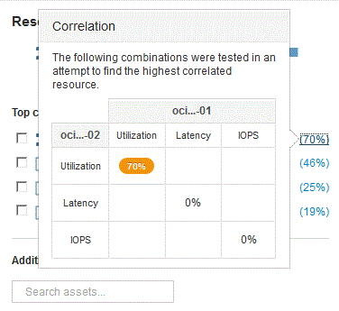

= 分析相關資源
:allow-uri-read: 
:icons: font
:imagesdir: ../media/

[role="lead"]
當您在研究效能問題時、開啟裝置的_asset頁面_時、您應該使用最重要的關聯資源清單來精簡效能圖表中顯示的資料。百分比較高的資源表示資源與基礎資源具有類似的活動。

== 關於這項工作

您正在調查效能問題、並開啟裝置的資產頁面。

== 步驟

. 在*最高關聯資源*清單中、第一個資源是基礎資源。清單中的關聯資源會依第一個裝置的關聯活動百分比排序。按一下連結的關聯百分比以查看詳細資料。在此範例中、70%的關聯是在使用率中、因此基礎資源和此相關資源的使用率都同樣高。
+

. 若要將關聯資源新增至效能圖表、請選取您要新增之資源*頂端關聯資源*清單中的核取方塊。根據預設、每個資源都會提供可用的總資料、但您可以從核取方塊的功能表中選取「只讀取」或「只寫入資料」。
+
圖表中的每個資源都有不同的色彩、因此您可以比較每個資源的效能測量值。只會針對所選的測量指標繪製適當類型的資料。例如、CPU資料不包含讀取或寫入度量、因此只有「總資料」可用。

. 按一下關聯資源的連結名稱、以顯示其資產頁面。
. 如果您在分析中未看到您認為應該考慮的最高關聯資源中列出某個資源、您可以使用*搜尋資產*方塊來尋找該資源。

