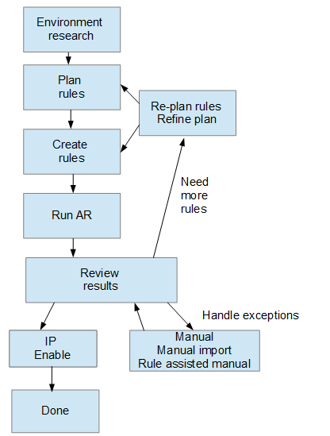

= 開始之前
:allow-uri-read: 
:icons: font
:imagesdir: ../media/

[role="lead"]
在定義識別裝置的規則之前、您必須先瞭解環境的設定方式。您對環境的瞭解越多、識別裝置就越容易。

您需要回答類似下列的問題、以協助您建立正確的規則：

* 您的環境是否具有區域或主機的命名標準、其中有多少百分比是正確的？
* 您的環境是否使用交換器別名或儲存別名、而且它們是否與主機名稱相符？
* 您的環境是否使用SRM工具、您可以使用它來識別主機名稱？SRM提供哪些涵蓋範圍？
* 您環境中的命名配置多久會改變一次？
* 是否有任何併購或合併引進不同的命名方案？

在分析環境之後、您應該能夠識別出哪些命名標準可以讓您預期在可靠性方面會遇到什麼問題。您收集到的資訊可能會以圖形呈現、如下圖所示：

image::../media/ar-workflow-circles.gif[AR工作流程圓圈]

在此範例中、儲存別名可可靠地代表最大數量的裝置。使用儲存別名識別主機的規則應先寫入、使用交換器別名的規則應在下一步寫入、最後建立的規則應使用區域別名。由於區域別名和交換器別名的使用重疊、部分儲存別名規則可能會識別其他裝置、因此區域別名和交換器別名所需的規則較少。

== 定義環境中裝置的步驟

一般而言、您會使用類似下列的工作流程來識別環境中的裝置。識別是一種迭代的程序、可能需要多個步驟來規劃和完善規則。

[NOTE]
====
如果您的環境中有未識別的裝置（也稱為「未知」或一般裝置）、而您隨後設定了在輪詢時識別這些裝置的資料來源、則這些裝置將不再顯示或被視為一般裝置。

====