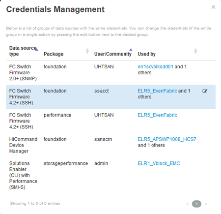

= 變更資料來源認證
:allow-uri-read: 
:icons: font
:imagesdir: ../media/

[role="lead"]
如果同類型的多個資料來源共用使用者名稱和密碼、您可以同時變更群組中所有裝置的密碼。

== 步驟

. 在Insight工具列上、按一下*管理*。
+
「*資料來源*」清單隨即開啟。

. 按一下「*動作*」按鈕、然後選取「*變更認證*」選項。
. 在「認證管理」對話方塊中、從清單中選取其中一個資料來源群組。
+
「編輯」圖示（一張紙上的筆）會變成右側的作用中圖示。

+

. 按一下 * 編輯 * 。
. 輸入新密碼並加以確認。

