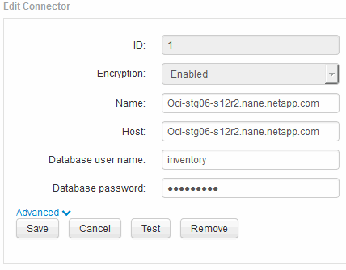
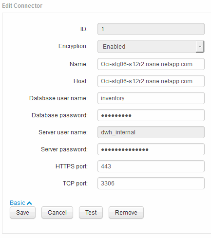

= 使用伺服器連線組態UI變更「庫存」和「dwh_internal」密碼
:allow-uri-read: 
:icons: font
:imagesdir: ../media/

[role="lead"]
如果您需要變更「Inventory」或「dwh_internal」密碼、以符合Insight伺服器上的密碼、請使用Data倉儲UI。

== 開始之前

您必須以系統管理員身分登入才能執行此工作。

== 步驟

. 登入資料倉儲入口網站： https://hostname/dwh[]、其中、主機名稱是OnCommand Insight 安裝了「IsorData倉儲」的系統名稱。
. 在左側的導覽窗格中、按一下* Connectors *。
+
此時將顯示*編輯連接器*畫面。

+

. 在「*資料庫密碼*」欄位中輸入新的「'inventory'」密碼。
. 按一下「*儲存*」
. 若要變更「dwh_internal」密碼、請按一下*進階。*
+
此時會顯示Edit Connector Advanced（編輯連接器進階）畫面。

+

. 在*伺服器密碼*欄位中輸入新密碼：
. 按一下儲存。

