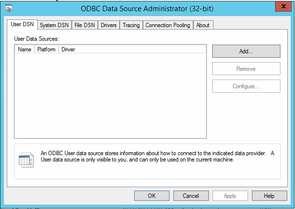
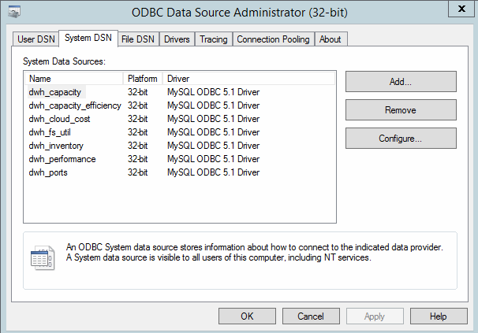
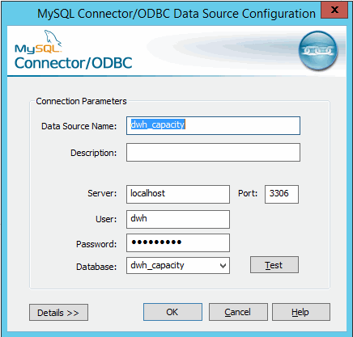

= 使用「ODBC管理」工具變更dwh密碼
:allow-uri-read: 
:icons: font
:imagesdir: ../media/

[role="lead"]
當您在Insight伺服器上變更dwh使用者的密碼時、也必須在Data倉儲伺服器上變更密碼。您可以使用「ODBC資料來源管理員」工具來變更資料倉儲上的密碼。

== 開始之前

您必須使用具有系統管理員權限的帳戶、遠端登入Data倉儲伺服器。

== 步驟

. 遠端登入裝載該資料倉儲的伺服器。
. 存取位於的「ODBC行政」工具 `C:\Windows\SysWOW64\odbcad32.exe`
+
系統會顯示「ODBC資料來源管理員」畫面。

+

. 單擊*系統DSN*
+
系統資料來源隨即顯示。

+

. 從OnCommand Insight 清單中選取一個「支援資料來源」。
. 按一下「*設定*」
+
此時會顯示「Data來源組態」畫面。

+

. 在*密碼*欄位中輸入新密碼。

