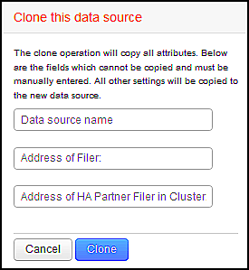

= 複製資料來源
:allow-uri-read: 
:icons: font
:imagesdir: ../media/

[role="lead"]
使用複製工具、您可以快速新增與其他資料來源具有相同認證和屬性的資料來源。複製可讓您輕鬆設定相同裝置類型的多個執行個體。

== 步驟

. 在Insight工具列上、按一下*管理*。
+
資料來源清單隨即開啟。

. 反白顯示含有您要用於新資料來源之設定資訊的資料來源。
. 在反白顯示的資料來源右側、按一下* Clone（複製）*圖示。
+
Clone this data source（複製此資料來源）對話方塊會列出您必須為所選資料來源提供的資訊、如以下NetApp資料來源範例所示：

+

. 在欄位中輸入必要資訊；這些詳細資料無法從現有的資料來源複製。
. 按一下* Clone（複製）*。

== 結果

複製作業會複製所有其他屬性和設定、以建立新的資料來源。
