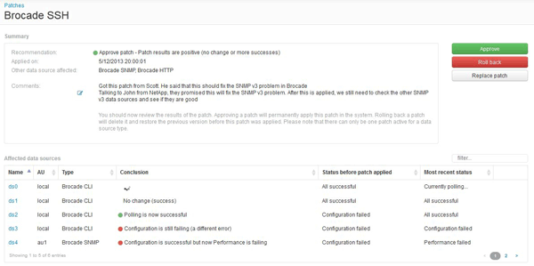

= 提交資料來源修補程式
:allow-uri-read: 
:icons: font
:imagesdir: ../media/

[role="lead"]
您可以使用修補程式摘要中的資訊來決定修補程式是否如預期執行、然後將修補程式提交到您的網路。

== 開始之前

您已安裝修補程式、需要判斷修補程式是否成功且應獲得核准。

== 步驟

. 在Insight工具列上、按一下*管理*。
. 按一下*修補程式*。
+
如果沒有安裝修補程式、目前正在審查的修補程式是空的。

. 在*目前正在審查的修補程式*中、檢查目前正在套用的資料來源修補程式狀態。
. 若要檢查與特定修補程式相關的詳細資料、請按一下該修補程式的連結名稱。
. 在本例所示的「修補程式」摘要資訊中、請查看*建議*和*建議*、以評估修補程式的進度。
+

. 查看*受影響的資料來源*表格、查看修補程式前後每個受影響資料來源的狀態。
+
如果您擔心其中一個要修補的資料來源發生問題、請按一下「受影響的資料來源」表格中的「連結名稱」。

. 如果您認為該修補程式應套用至該類型的資料來源、請按一下* Approve *。
+
資料來源將會變更、並從目前正在審查的修補程式中移除修補程式。

