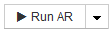

= 建立裝置解決規則
:allow-uri-read: 
:icons: font
:imagesdir: ../media/

[role="lead"]
您可以建立裝置解析規則、以識別OnCommand Insight 目前無法自動識別的主機、儲存設備和磁帶。您所建立的規則可識別環境中目前的裝置、並可識別新增至環境中的類似裝置。

== 關於這項工作

當您建立規則時、首先要識別規則執行的資訊來源、擷取資訊的方法、以及是否將DNS查詢套用至規則的結果。

|===

 a| 
用於識別裝置的來源

 a| 
* 主機的SRM別名
* 包含內嵌主機或磁帶名稱的儲存別名
* 包含內嵌主機或磁帶名稱的交換器別名
* 包含內嵌主機名稱的區域名稱

 a| 
從來源擷取裝置名稱的方法

 a| 
* 原點（從SRM擷取名稱）
* 分隔符號
* 規則運算式

 a| 
DNS查詢

 a| 
指定您是否使用DNS驗證主機名稱。

|===
您可以在「自動解決規則」索引標籤中建立規則。下列步驟說明規則建立程序。

== 步驟

. 按一下「*管理*>*裝置解析度*」
. 在*自動解決規則*索引標籤中、按一下「*+新增*」
+
隨即顯示New Rule（新規則）畫面。

+
[NOTE]
====
「新規則」畫面包含*？*圖示、提供建立規則運算式的說明和範例。

====
. 在*類型*清單中、選取您要識別的裝置。
+
您可以選取主機或磁帶。

. 在*來源*清單中、選取您要用來識別主機的來源。
+
根據您選擇的來源、Insight會顯示下列回應：

+
** 區域列出Insight需要識別的區域和WWN。
** SRM列出Insight需要識別的不明別名
** 儲存別名列出需要Insight識別的儲存別名和WWN
** 交換器別名列出Insight需要識別的交換器別名

. 在「*方法*」清單中、選取您要用來識別主機的方法。
+
|===

| 來源 | 方法 

 a| 
SRM
 a| 
「as is」、「delimiters'」、「regular Expressions」

 a| 
儲存別名
 a| 
「刪除者」或「正則表達式」

 a| 
交換器別名
 a| 
「刪除者」或「正則表達式」

 a| 
區域
 a| 
「刪除者」或「正則表達式」

|===
+
** 使用「限制者」的規則需要分隔符號和主機名稱的最小長度。
+
主機名稱的最小長度為Insight用於識別主機的字元數。Insight只會針對這麼長或更長的主機名稱執行DNS查詢。

+
對於使用分隔符號的規則、輸入字串會以分隔符號標記、並會建立多個鄰近標記組合的主機名稱候選清單。然後將清單排序、從最大到最小。例如、對於vipsnq03_hba3_emc3_12ep0、清單會產生下列結果：

+
*** vipsnq03_hba3_emc3_12ep0
*** vipsnq03_hba3_emc3
*** hba3 emc3_12ep0
*** vipsnq03_hba3
*** emc3_12ep0
*** hba3_emc3
*** vipsnq03
*** 12ep0
*** emc3.
*** Hba3.

** 使用「regular expression'」的規則需要規則運算式、格式和大小寫敏感度選擇。

. 按一下  若要執行所有規則、或按一下按鈕中的向下箭號、以執行您建立的規則（以及自上次完整執行AR之後所建立的任何其他規則）。

== 結果

規則執行的結果會顯示在FC識別索引標籤中。
