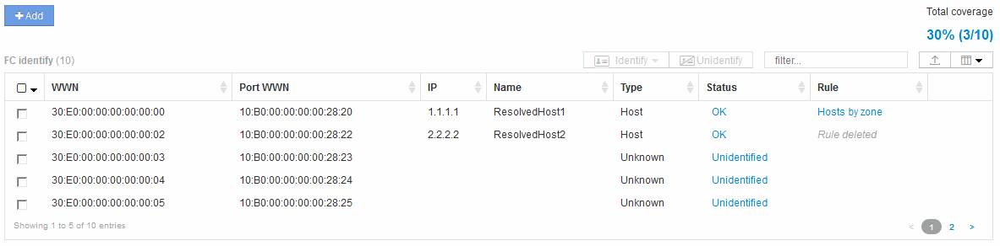

= Fibre Channel裝置解析度
:allow-uri-read: 
:icons: font
:imagesdir: ../media/

[role="lead"]
FC識別畫面會顯示光纖通道裝置的WWN和WWPN、這些裝置的主機尚未透過自動裝置解析來識別。此畫面也會顯示已手動解決裝置問題的所有裝置。

已手動解析的裝置狀態為「OK」、並識別用於識別裝置的規則。遺失的裝置狀態為「Unidentified」（未識別）。本頁列出識別裝置的總涵蓋範圍。

您可以在FC識別畫面左側選取多個裝置、以執行大量動作。將游標移到裝置上、然後選取清單最右側的識別或取消識別按鈕、即可在單一裝置上執行動作。

「Total overage（總涵蓋範圍）」連結會顯示您組態的「Number of devices identified / Number of devices Available（已識別的裝置數量/可用的裝置數量）」清單：

* SRM別名
* 儲存別名
* 交換器別名
* 區域
* 使用者定義

