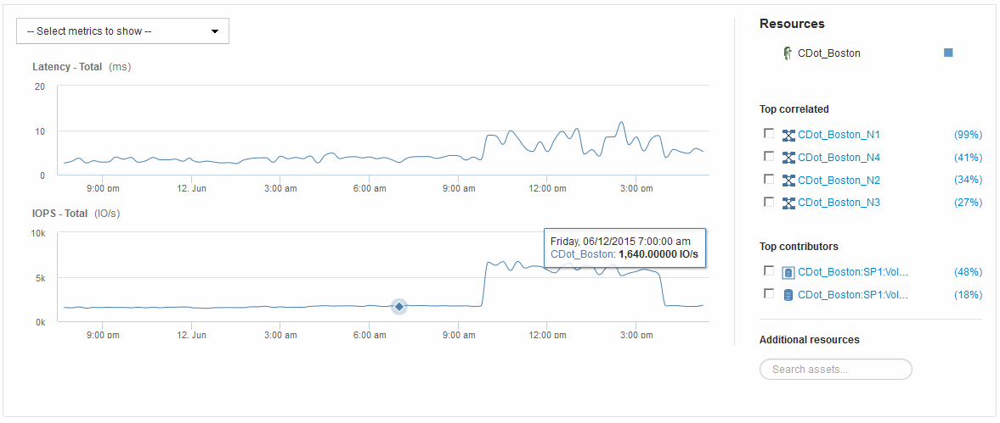

= 專家觀點
:allow-uri-read: 
:icons: font
:imagesdir: ../media/

[role="lead"]
資產頁面的「專家檢視」區段可讓您根據所選期間（3小時、24小時、3天、7天、 或自訂期間）。

以下是Volume資產頁面中「專家檢視」區段的範例：

您可以在效能圖表中選取所選期間內要檢視的指標。

「資源」區段會顯示基礎資產的名稱、以及效能圖表中代表基礎資產的色彩。如果Top Correlated區段未包含您想要在效能圖表中檢視的資產、您可以使用「其他資源」區段中的「*搜尋資產*」方塊來找出資產並將其新增至效能圖表。當您新增資源時、這些資源會顯示在「其他資源」區段中。

如適用、「資源」區段也會顯示下列類別中與基礎資產相關的任何資產：

* 最高關聯
+
顯示與基礎資產有高關聯性（百分比）的資產、以及一或多個效能指標。

* 頂尖貢獻者
+
顯示對基礎資產貢獻（百分比）的資產。

* 貪婪
+
顯示透過共用相同資源（例如主機、網路和儲存設備）而從資產中移走系統資源的資產。

* 降級
+
顯示因此資產而耗盡系統資源的資產。

