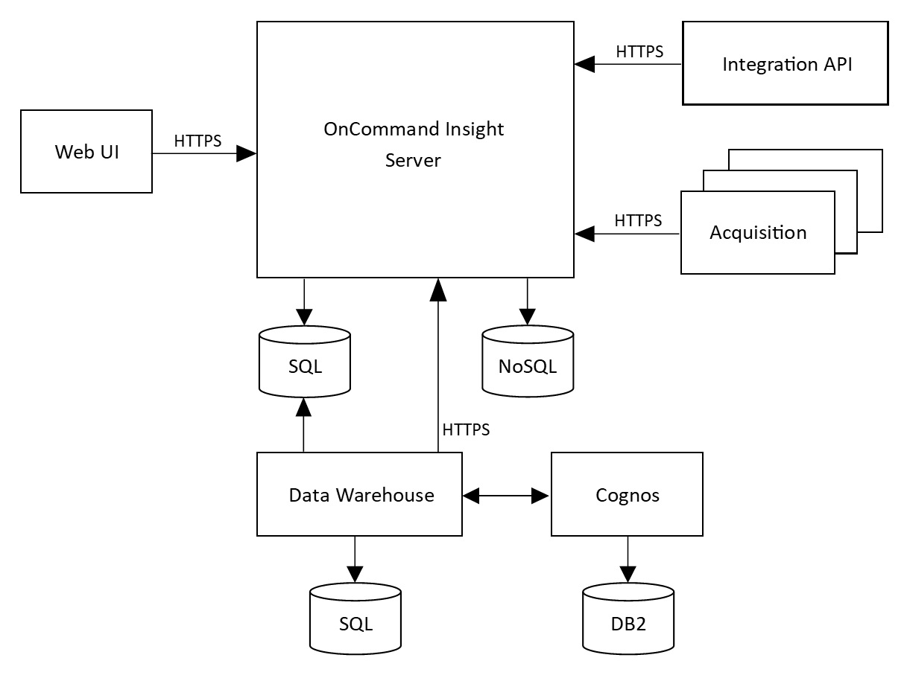

= Insight架構
:allow-uri-read: 
:icons: font
:imagesdir: ../media/

[role="lead"]
典型的安裝功能包括資料擷取和資料倉儲及報告、所有這些都可從網路型UI輕鬆存取OnCommand Insight 。若要提升環境安全、可透過遠端擷取設備進行採購。

Insight架構的主要元件如下圖所示：

* *《伺服器*》OnCommand Insight
+
此伺服器OnCommand Insight 包含主要的資料儲存庫和分析元件。伺服器持續建置環境的端點對端點拓撲、分析環境、並在偵測到事件或違規時產生警示。

* *併購*
+
Insight集合引擎是以一或多個擷取單元為建置基礎。每部Insight伺服器都包含本機擷取單元、可支援遠端擷取單元。每個單元都是在網路上執行的服務、可存取（透過稱為_data sources_的模組）、並從資料中心的裝置收集資料。擷取單位所收集的資訊會傳送至伺服器進行分析。

+
集合引擎設計為高度模組化且容易修補。

* *整合API*
+
API允許從外部代理程式收集資料。您可以使用查詢和小工具、在Web UI中檢視整合資料。儀表板可包含「原生」Insight資料和整合資料。您可以將篩選、彙總和分組套用至這些儀表板中的資料。

* *網路Ui*
+
適用於Insight的HTML5網路型使用者介面可讓您設定資料來源和監控環境、包括原則、臨界值和警示。接著、您可以使用網路UIasset儀表板和資產頁面來識別及研究潛在問題。您可以使用各種小工具來建立自訂儀表板、每個小工具都能在顯示、分析及記錄資料方面提供廣泛的靈活度。

* *資料倉儲*
+
「Data倉儲」是一個集中儲存庫、可儲存來自多個Insight伺服器OnCommand Insight 的資料、並將資料轉換成通用的多維資料模型、以供查詢和分析。

+
利用此功能、您可以存取由數個資料市場所組成的開放式資料庫、以便產生自訂容量與效能報告、例如計費報告、含歷史資料的趨勢報告、使用分析及預測報告OnCommand Insight 。

+
資料倉儲會整合及準備資料、以便針對一或多個Insight安裝進行報告。這些資料包括歷史記錄、趨勢、庫存、計費、回饋和資料簡報、可支援資料中心基礎架構的長期規劃。

* * Cognos *
+
Cognos是Insight的報告引擎、這是IBM商業智慧工具、可讓您檢視預先定義的報告或建立自訂報告。Insight報告會從資料倉儲資料產生報告。

