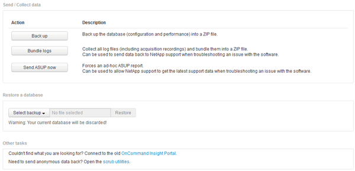

= 還原Insight資料庫
:allow-uri-read: 
:icons: font
:imagesdir: ../media/

[role="lead"]
若要從通過驗證的備份檔案還原Insight資料庫、請使用疑難排解選項。這項作業完全取代您目前OnCommand Insight 的各項資料。

== 開始之前

最佳實務做法：**在還原OnCommand Insight 您的還原資料庫之前、請先使用手動備份程序來建立目前資料庫的複本。請檢查您打算還原的備份檔案、確定備份成功、其中包含您要還原的檔案。

== 步驟

. 在Insight工具列上、按一下*管理*。
. 按一下*疑難排解*。
+

. 在「還原資料庫」區段中、從*選取備份*功能表中選取您要還原的備份檔案。
. 按一下 * 還原 * 。
. 在「所有資料都會被取代」的警告上、按一下「*確定*」
+
還原活動的狀態會顯示在還原頁面上。

