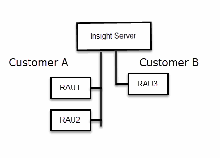

= Insight Security
:allow-uri-read: 
:icons: font
:imagesdir: ../media/

[role="lead"]
7.3.1版OnCommand Insight 的功能介紹安全功能、可讓Insight環境以增強的安全性運作。這些功能包括加密、密碼雜湊、以及變更加密和解密密碼的內部使用者密碼和金鑰配對的能力。您可以在Insight環境中的所有伺服器上管理這些功能。

Insight的預設安裝包括安全性組態、讓您環境中的所有站台共用相同的金鑰和相同的預設密碼。為了保護敏感資料、NetApp建議您在安裝或升級後變更預設金鑰和擷取使用者密碼。

資料來源加密密碼儲存在Insight Server資料庫中。伺服器具有公開金鑰、當使用者在WebUI資料來源組態頁面中輸入密碼時、會加密這些密碼。伺服器沒有解密儲存在伺服器資料庫中的資料來源密碼所需的私密金鑰。只有擷取單位（Lau、Rau）擁有解密資料來源密碼所需的資料來源私密金鑰。

== 重新輸入伺服器金鑰

使用預設金鑰會在您的環境中引進安全性弱點。根據預設、資料來源密碼會加密儲存在Insight資料庫中。加密時會使用所有Insight安裝通用的金鑰。在預設組態中、傳送至NetApp的Insight資料庫包含理論上可由NetApp解密的密碼。

== 變更擷取使用者密碼

使用預設的「擷取」使用者密碼會在您的環境中引入安全性弱點。所有擷取設備都會使用「擷取」使用者與伺服器通訊。使用預設密碼的Raus理論上可以使用預設密碼連線至任何Insight伺服器。

== 升級與安裝考量

如果Insight系統包含非預設的安全性組態（您已重新輸入或變更密碼）、則必須備份安全性組態。安裝新軟體、或在某些情況下升級軟體、會將系統還原為預設的安全組態。當系統恢復為預設組態時、您必須還原非預設組態、系統才能正常運作。

== 在複雜的服務供應商環境中管理金鑰

服務供應商可以託管OnCommand Insight 多個收集資料的客戶。這些金鑰可防止Insight伺服器上的多個客戶未經授權存取客戶資料。每位客戶的資料都受到其特定金鑰配對的保護。

Insight實作可設定如下圖所示。

您需要在此組態中為每位客戶建立個別的金鑰。客戶A需要兩個Raus相同的金鑰。客戶B需要一組金鑰。

您將採取哪些步驟來變更客戶A的加密金鑰：

. 遠端登入裝載RAU1的伺服器。
. 啟動安全性管理工具。
. 選取變更加密金鑰以取代預設金鑰。
. 選取備份以建立安全性組態的備份壓縮檔。
. 遠端登入裝載RAU2的伺服器。
. 將安全組態的備份壓縮檔複製到RAU2。
. 啟動安全性管理工具。
. 將安全備份從RAU1還原至目前的伺服器。

變更客戶B加密金鑰的步驟：

. 遠端登入裝載RAU3的伺服器。
. 啟動安全性管理工具。
. 選取變更加密金鑰以取代預設金鑰。
. 選取備份以建立安全性組態的備份壓縮檔。

