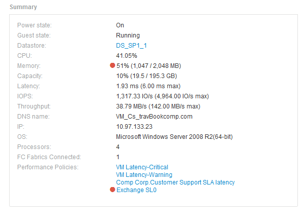

= 摘要
:allow-uri-read: 
:icons: font
:imagesdir: ../media/

[role="lead"]
資產頁面上的「摘要」區段會顯示特定資產的相關資訊摘要、並顯示與資產相關的問題、以紅色圓圈表示、並提供超連結、可連結至相關資產的其他資訊、以及指派給該資產的任何效能原則。

以下範例顯示虛擬機器資產頁面的「摘要」區段中可用的部分資訊類型。旁邊有一個紅色圓圈的任何項目、都表示受監控環境可能發生問題。

