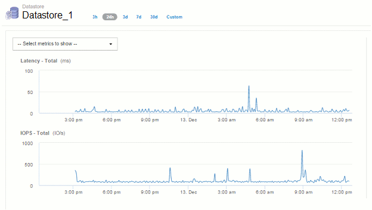
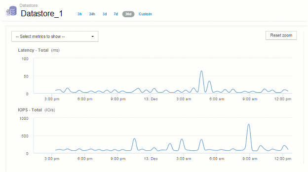

= 存留時間（TTL）和縮減取樣的資料
:allow-uri-read: 
:icons: font
:imagesdir: ../media/

[role="lead"]
從OnCommand Insight 7.3開始、資料保留或存留時間（TTL）已從7天增加至90天。因為這意味著圖表和表格的資料處理量會增加許多、而且可能會有成千上萬個資料點、因此資料會在顯示之前先進行縮減取樣。

縮減取樣提供圖表中資料的統計近似、讓您能夠有效地概述資料、而不需要顯示每個資料點、同時維持所收集資料的正確檢視。

== 為何需要縮減取樣？

Insight 7.3可將資料的存留時間（TTL）增加至90天。這表示準備資料以在圖表中顯示所需的處理量增加。為了讓圖表快速且有效率地顯示、資料會以保留圖表整體圖形的方式進行縮減取樣、而不需要處理該圖表的每個資料點。

[NOTE]
====
在降級取樣期間不會遺失任何實際資料。您可以依照下列步驟、選擇檢視圖表的實際資料、而非縮減取樣資料。

====

== 縮減取樣的運作方式

資料會在下列情況下降級：

* 如果您所選的時間範圍包含7天或更短的資料、則不會發生降級。圖表會顯示實際資料。
* 如果您所選的時間範圍包含超過7天的資料、但資料點少於1、000個、則不會進行降級取樣。圖表會顯示實際資料。
* 如果您所選的時間範圍包含超過7天的資料和超過1、000個資料點、則會將資料降級。圖表會顯示近似資料。

下列範例顯示正在進行降級取樣。第一個圖例顯示資料存放區資產頁面上24小時內的延遲和IOPS圖表、如資產頁面時間選取器上的* 24h*所示。您也可以選取*自訂*並將時間範圍設定為相同的24小時週期、以查看相同的資料。

由於我們選擇的時間範圍少於7天、而且要記錄的資料點少於1、000個、因此顯示的資料是實際資料。不會發生降級取樣。

不過、如果您要檢視資料、請在資產頁面時間選取器上選擇* 30d*、 或是將自訂時間範圍設定為7天以上（或Insight在所選時間期間收集超過1、000個資料樣本）、則會先將資料降級、然後再顯示。當您放大縮小取樣的圖表時、畫面會繼續顯示近似的資料。

[NOTE]
====
當您放大縮小取樣的圖表時、縮放是數位縮放。螢幕會繼續顯示近似資料。

====
您可以在下圖中看到這一點、其中時間範圍會先設定為30d、然後再放大圖表、以顯示與上述相同的24小時期間。

縮減取樣的圖表顯示的時間與上方「實際」圖表相同、因此這些圖表的一般形狀相同、可讓您快速找出效能資料中有趣的高峰或低谷。

[NOTE]
====
由於資料的縮減取樣方式、比較縮減取樣與時、圖表線可能會稍微偏離實際資料、以便更妥善地對齊圖形。然而、差異極小、不會影響所顯示資料的整體準確度。

====

== 縮減取樣圖表上的違規行為

檢視下取樣圖表時、請注意、不會顯示違規情形。若要查看違規情形、您可以執行下列兩項操作之一：

* 選取資產頁面時間選取器中的「自訂」、然後輸入7天內的時間範圍、即可檢視該時間範圍的實際資料。將游標暫留在每個紅點上。工具提示會顯示發生的違規情形。
* 請記下時間範圍、並在違規儀表板中找到違規。

