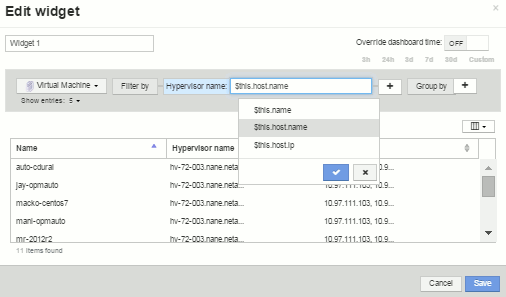

= 瞭解「$this」變數
:allow-uri-read: 
:icons: font
:imagesdir: ../media/

[role="lead"]
資產「額外資料」可自訂頁面上的特殊變數、可讓您輕鬆展示與目前資產直接相關的其他資訊。

== 關於這項工作

若要在資產的可自訂登陸頁面上的小工具中使用「$this」變數、請依照下列步驟操作。在此範例中、我們會新增表格小工具。

[NOTE]
====
「$this」變數僅適用於資產的可自訂登陸頁面。其他Insight儀表板則無法使用。可用的「$this」變數會因資產類型而異。

====

== 步驟

. 瀏覽至所選資產的資產頁面。在此範例中、我們來選擇「虛擬機器（VM）」資產頁面。查詢或搜尋VM、然後按一下連結前往該VM的資產頁面。
+
此時會開啟VM的資產頁面。

. 按一下「*變更檢視：*>*其他虛擬機器資料*」下拉式清單、前往該資產的可自訂登陸頁面。
. 按一下「*小工具*」按鈕、然後選擇「*表格小工具*」。
+
「表格」小工具隨即開啟以供編輯。根據預設、所有儲存都會顯示在表格中。

. 我們想要顯示所有的虛擬機器。按一下資產選取器、並將* Storage *變更為* Virtual Machine *。
+
所有虛擬機器現在都會顯示在表格中。

. 按一下*欄選擇器*按鈕image:../media/column-picker-button.gif[""]並將* Hypervisor名稱*欄位新增至資料表。
+
表中顯示每個VM的Hypervisor名稱。

. 我們只關心裝載目前VM的Hypervisor。按一下*篩選條件*欄位的**+**按鈕、然後選取* Hypervisor名稱*。
. 按一下「* any *」、然後選取「*$this.host.name *」變數。按一下檢查按鈕以儲存篩選條件。
+

. 下表顯示目前VM Hypervisor所託管的所有VM。按一下「 * 儲存 * 」。

== 結果

您為此虛擬機器資產頁面所建立的表格、將會顯示您所顯示的任何VM資產頁面。在小工具中使用*$this.host.name變數、表示表格中只會顯示目前資產Hypervisor所擁有的VM。
