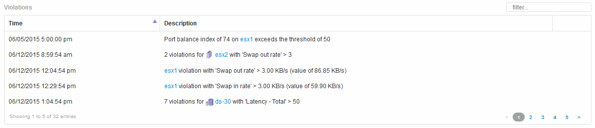

= 違規
:allow-uri-read: 
:icons: font
:imagesdir: ../media/

[role="lead"]
您可以使用資產頁面的「違規」區段、查看指派給資產的效能原則所造成的環境違規（如果有）。效能原則可監控網路臨界值、並讓您立即偵測臨界值違規、識別其影響、並以能夠快速有效修正的方式分析問題的影響和根本原因。

以下範例顯示Hypervisor資產頁面上顯示的「違規」區段：

