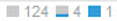

= 使用「異常」區段
:allow-uri-read: 
:icons: font
:imagesdir: ../media/

[role="lead"]
「異常」區段僅會顯示在應用程式資產頁面上、可深入瞭解應用程式基礎架構、並可讓您識別可能導致服務中斷的異常行為。

== 步驟

. 開啟所需應用程式的異常監控功能、並允許其收集資料。
. 當異常偵測引擎正在執行時、您可以在應用程式資產頁面的* Anomalies*區段中檢視下列資訊：
+
** 異常偵測分數會以藍色長條顯示、代表0到100之間的分數。評分會逐資源執行、並逐一進行計數、進而為整個應用程式基礎架構提供整體重要分數。
** 應用程式資產檢視
+
位於異常偵測分數下方、顯示所有資產對目前異常分數的貢獻。如果某項資產未大幅提高異常分數、則會以表示 。如果資產造成異常分數的重要性、則會出現1、2或3個藍色長條、例如： 。以長條數表示的值表示該資產對異常分數的貢獻意義、如下所示：1長條= 1-33；2長條= 34至67；3長條= 68至100。

+
指派給應用程式（主機、虛擬機器、磁碟區、內部磁碟區和Hypervisor）的資產、以及基礎架構中以某種方式連接至指派資產（例如節點、連接埠等）的資產、都有助於形成異常偵測分數。這兩種造成特定異常狀況的資產都會顯示出來、因為分配的應用程式資源中的資料可能會流經這些資產。

+
如果一種類型的資產超過60項、則會顯示*更多*按鈕、您可以按一下按鈕來顯示其餘資產。這些剩餘資產的狀態、例如 ，顯示在* More（更多）*按鈕旁邊。此範例指出、在未顯示的129項資產中、有124項資產並未構成異常分數、但其中有5項資產確實對異常分數有某種程度的影響。

** 異常圖表
+
異常圖表會顯示時間範圍內的最高異常分數、以橘色圓圈表示（3小時、24小時、3天、7天、30天、 或自訂時間範圍）。您可以將指標拖曳到圖表上、查看時間範圍內其他點的異常分數（以藍色圓圈表示）、然後按一下藍色圓圈。 這會更新應用程式資產檢視、以顯示當時分數的相關資產。

. 若要協助您疑難排解資產效能、您可以執行下列動作、將應用程式資產檢視中的資產新增至應用程式資產頁面的專家檢視圖表：
+
.. 按一下應用程式資產檢視中的資產圖示。
+
以下顯示：資產名稱（即資產頁面的超連結）、造成異常狀況的指標、資產貢獻的重要性、以及可讓您將資產新增至專家檢視圖表的按鈕。

.. 按一下 。

+
資產即會新增至專家檢視圖表。

