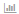

= 使用「相關資產」區段
:allow-uri-read: 
:icons: font
:imagesdir: ../media/

[role="lead"]
「相關資產」區段可讓您檢視任何與基礎資產相關的資產。每項相關資產都會顯示在表格中、以及該資產的相關統計資料。您可以匯出資產資訊、在「專家檢視」效能圖表中檢視資產統計資料、或顯示僅顯示相關資產統計資料的圖表。

== 步驟

. 登入OnCommand Insight 到The W不明 網路UI。
. 執行下列其中一項動作、找出資產頁面：
+
** 在Insight工具列上、按一下 image:../media/icon-sanscreen-magnifying-glass-gif.gif[""]，輸入資產名稱，然後從清單中選取資產。
** 按一下*儀表板*、選取*資產儀表板*、找出資產名稱、然後按一下。隨即顯示「資產」頁面。

. 若要控制資產在表格中的顯示方式：
+
** 按一下任何資產的名稱、即可顯示其資產頁面。
** 使用「*篩選*」方塊僅顯示特定資產。
** 如果資料表中有五項以上的資產、請按一下頁碼以逐頁瀏覽資產。
** 按一下欄標題中的箭號、將表格中欄的排序順序變更為遞增（向上箭頭）或遞減（向下箭頭）。
** 將游標放在相關資產上、然後按一下、即可將相關資產新增至「專家檢視」區段中的任何效能圖表 image:../media/add-to-expert-view-graph.gif[""]。

. 可將表格中顯示的資訊匯出至 `.CSV` 檔案：
+
.. 按一下 image:../media/export-to-csv.gif[""]。
.. 按一下「*開啟方式*」、然後按一下「*確定*」、以Microsoft Excel開啟檔案並將檔案儲存至特定位置、或按一下「*儲存檔案*」、然後按一下「*確定*」、將檔案儲存至「下載」資料夾。
+
目前選取要顯示之欄的所有物件屬性都會匯出至檔案。只會匯出顯示欄的屬性。請注意、只會匯出表格的前10、000列。

. 若要在表格下方的圖表中顯示相關資產資訊、請按一下  並執行下列任何一項：
+
** 按一下*讀取*、*寫入*或*總計*以變更顯示的度量資料。*總計*為預設值。
** 按一下 image:../media/pencil-icon-landing-page-be.gif[""] 以選取不同的度量。
** 按一下  變更圖表類型。*折線圖*為預設值。
** 將游標移到圖表中的資料點上、查看在每項相關資產所選期間內、度量值的變化情況。
** 按一下圖表圖例中的相關資產、將其新增至圖表或從圖表中移除。
** 按一下相關資產表中的頁碼、即可檢視圖表中的其他相關資產。
** 按一下  以關閉圖表。

