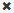

= 使用「違規」區段
:allow-uri-read: 
:icons: font
:imagesdir: ../media/

[role="lead"]
「違規」區段可讓您檢視及管理指派給資產的效能原則所造成的任何網路違規事件。

== 步驟

. 登入OnCommand Insight 到The W不明 網路UI。
. 執行下列其中一項動作、找出資產頁面：
+
** 在Insight工具列上、按一下 image:../media/icon-sanscreen-magnifying-glass-gif.gif[""]，輸入資產名稱，然後從清單中選取資產。
** 按一下*儀表板*、選取*資產儀表板*、找出資產名稱、然後按一下。隨即顯示「資產」頁面。「違規」區段會顯示違規發生的時間、以及超過的臨界值說明、以及發生違規事件之資產的超連結（例如「2個違規事件符合DS-30的延遲時間-總計> 50」）。

. 您可以執行下列任一選用工作：
+
** 使用*篩選器*方塊僅顯示特定違規。
** 如果表格中有五個以上違規、請按一下頁碼、瀏覽違規情形。
** 按一下欄標題中的箭號、將表格中欄的排序順序變更為遞增（向上箭頭）或遞減（向下箭頭）。
** 按一下任何說明中的資產名稱、即可顯示其資產頁面；紅色圓圈表示需要進一步調查的問題。
+
您可以按一下顯示「編輯原則」對話方塊的效能原則、以檢閱效能原則、並視需要變更原則。

** 按一下  如果您判斷問題不再是引起疑慮的原因、請從清單中移除違規行為。

