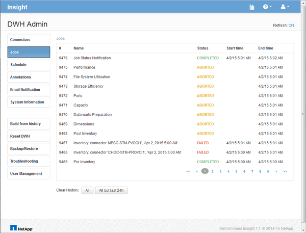

= 存取資料倉儲入口網站
:allow-uri-read: 
:icons: font
:imagesdir: ../media/

[role="lead"]
《The》資料倉儲入口網站是網路型使用者介面、OnCommand Insight 可用來更新連接器資訊、檢視工作佇列、排程每日建置、選取註釋、設定電子郵件通知、檢視系統資訊、建置資料庫、重設資料倉儲、備份及還原資料庫、疑難排解問題、 管理資料倉儲與報告入口網站使用者帳戶、並存取文件與架構圖表。

== 步驟

. 登入資料倉儲入口網站： `+https://hostname/dwh+`、其中 `hostname` 是OnCommand Insight 安裝了IsName Data倉儲的系統名稱。
. 輸入您的使用者名稱和密碼。
. 按一下*登入*。
+
資料倉儲入口網站隨即開啟：

+

