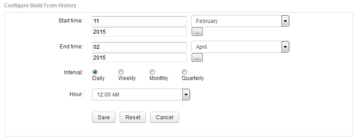

= 新增從歷史記錄建立資料倉儲資料庫的工作
:allow-uri-read: 
:icons: font
:imagesdir: ../media/

[role="lead"]
您可以使用OnCommand Insight 保存在您的伺服器上的歷史資料來建置Data倉儲資料庫、以便執行投影報告。

== 開始之前

您必須在OnCommand Insight 伺服器上更新註釋、並強制更新Data倉儲的註釋資訊。

== 步驟

. 登入資料倉儲入口網站： `+https://hostname/dwh+`、其中 `hostname` 是OnCommand Insight 安裝了IsName Data倉儲的系統名稱。
. 在左側的導覽窗格中、按一下*從歷史記錄建置*。
+
image::../media/oci-dwh-admin-buildfromhistory-gif.gif[以歷史為基礎建置]

. 按一下「*設定*」。
+

. 輸入開始和結束時間。
+
若要顯示可從中選取這些日期的行事曆、請按一下月份名稱附近的向下箭頭。

+
時間格式取決於資料倉儲伺服器的地區設定。

+
開始和結束時間必須在OnCommand Insight 資料倉儲所連接之所有支援服務器的歷史記錄範圍內、如Data倉儲入口網站連接器選項所設定。預設的開始和結束時間會反映最大有效期間。資料倉儲建置工作會在您指定的時間自動執行。

+
[NOTE]
====
如果設定「每日執行4年」等不實際的排程、就會產生1460個建置週期、可能需要10天才能完成。

====
. 選擇時間間隔。
+
如果您選取每月或每週時間間隔、則會顯示「日」欄位。如果您選取「每月」、則「日期」為日期。如果您選擇「每週」、則日期為週日至週六。

. 選擇建置的時間。
. 或者、若要將選項恢復為預設設定、請按一下*重設*。
. 按一下「 * 儲存 * 」。
. 從*從歷史記錄建置*頁面、若要在自動排程建置之外執行建置、請按一下*執行*。
+
「目標時間」欄會顯示建立此項目的時間。「Status（狀態）」欄會顯示建置是否已完成。

