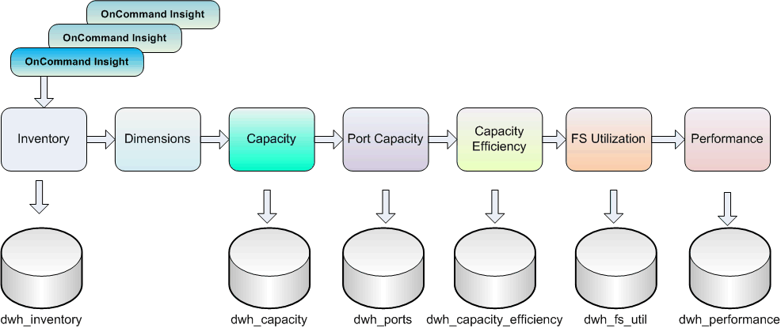

= 資料倉儲擷取資料的方式
:allow-uri-read: 
:icons: font
:imagesdir: ../media/

[role="lead"]
擷取、轉換及載入（ETL）程序會從多OnCommand Insight 個支援資料庫擷取資料、轉換資料、並將其儲存至資料行銷。

連接器會叫用一系列批次工作、從多個支援MySQL資料庫擷取資料、並以各種資料字元發佈資料、如下圖所示OnCommand Insight OnCommand Insight 。

ETL程序包括下列個別程序：

* *擷取*
+
此程序會從多OnCommand Insight 個支援資料的資料庫中取得資料、轉換資料、並將其儲存至資料倉儲中。此程序OnCommand Insight 會同時針對每個實例執行。為了確保執行資料清除和重複資料刪除、無法將ETL程序分割成多個排程的ETL作業。

* *轉換*
+
此程序會套用商業邏輯規則或功能、從OnCommand Insight 還原資料庫擷取資料。

* *負載*
+
此程序會將轉換後的資料載入公用資料集市。

