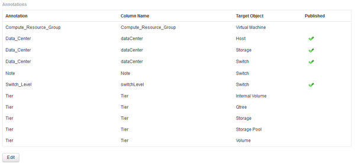
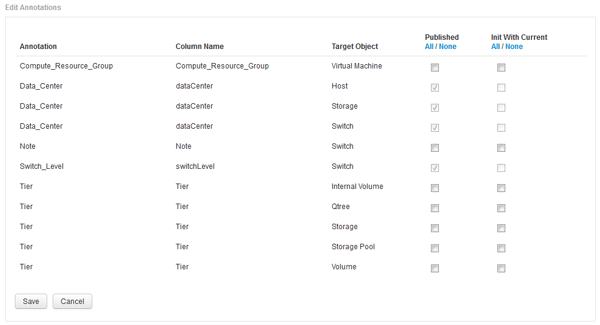

= 將使用者定義的註釋匯入資料倉儲
:allow-uri-read: 
:icons: font
:imagesdir: ../media/

[role="lead"]
強制OnCommand Insight 更新支援項目後、您需要在Data倉儲中選取您想要的註釋、然後開始建置Data倉儲。您可以等到下一個排定的建置、或是立即開始建置。

== 步驟

. 以系統管理員身分登入資料倉儲入口網站、網址為 `+https://hostname/dwh+`、其中 `hostname` 是OnCommand Insight 安裝了IsName Data倉儲的系統名稱。
. 在左側的導覽窗格中、按一下*註釋*。
+

+
此清單會顯示每個註釋類型的列、以及可指派註釋的目標物件。已發佈欄中的核取符號表示已為特定目標物件選取註釋、且已可透過Data倉儲資料標記使用。

. 按一下「*編輯*」、編輯註釋從OnCommand Insight 功能表匯入的方式。
+

. 若要編輯註釋程序、請執行下列步驟：
+
** 選取*已發佈*、將從OnCommand Insight S庫 擷取的註釋新增至資料倉儲資料庫。按一下*全部*以選取所有物件上的所有註釋。按一下「*無*」以確保未選取所有選項。
+
[NOTE]
====
取消核取此選項、即可從特定物件的庫存表和相關資料標記中移除註釋欄。如果任何自訂設計的報告使用註釋資料、則報告無法成功執行。

====
** 核取*使用目前*初始化、以使用目前的註釋值初始化Data倉儲維度表中的歷史資料。按一下*全部*以選取所有物件上的所有註釋。按一下「*無*」以確保未選取所有選項。此核取方塊會在註釋發佈後停用、而未發佈的註釋則會啟用此核取方塊。例如、如果主機註解註釋類型為「float」並取得值「1」、則host_dimel表格中該主機有3列、然後選取「Init with current*」、即可將host_dimate表格中所有3列的值「'1'」關聯在「Floor」欄中。如果未選取*使用目前*初始化、則只有該主機的最新資料列會在樓層欄中顯示「1」值。

. 按一下「 * 儲存 * 」。
+
此時會出現一則警告訊息、指出如果您要移除註釋、這會導致資料結構變更或資料遺失。

. 若要繼續、請按一下*是*。
+
資料倉儲會啟動非同步註釋工作、以套用要求的變更。您可以在「工作」頁面中看到工作。您也可以在Data倉儲資料庫架構中查看變更。

