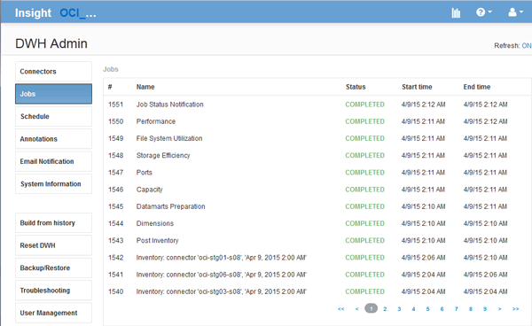

= 管理工作
:allow-uri-read: 
:icons: font
:imagesdir: ../media/

[role="lead"]
您可以查看目前工作及其狀態的清單。建置週期中的第一個工作是粗體類型。Data倉儲為每個連接器和每個資料倉儲所執行的建置、都被視為工作。

== 關於這項工作

您可以取消任何已排程或開始的擱置工作。您也可以清除先前執行工作的記錄。您可以清除未擱置、正在執行或正在中止的工作記錄。您可以清除前24小時以外的所有記錄或所有記錄、以移除最後一天的項目以外的所有項目。

您可以查看下列工作類型的相關資訊：授權、預先庫存、庫存、庫存過帳、維度、 資料中心準備、容量、連接埠、儲存效率、檔案系統使用率、 效能、工作狀態通知、歷史建置、動態註釋、連接器移除、 略過建置、電話首頁和維護。

維護工作每週執行一次、並使用MySQL工具來最佳化資料庫。

== 步驟

. 登入資料倉儲入口網站： `+https://hostname/dwh+`、其中 `hostname` 是OnCommand Insight 安裝了IsName Data倉儲的系統名稱。
. 在左側的導覽窗格中、按一下「*工作*」。
+

+
如果出現「Pending（擱置）」狀態、則會出現「cancel（取消）」連結

. 若要取消擱置中的工作、請按一下*取消*。
. 若要移除工作歷程記錄、請按一下*全部*或*全部、但最後24小時*。

