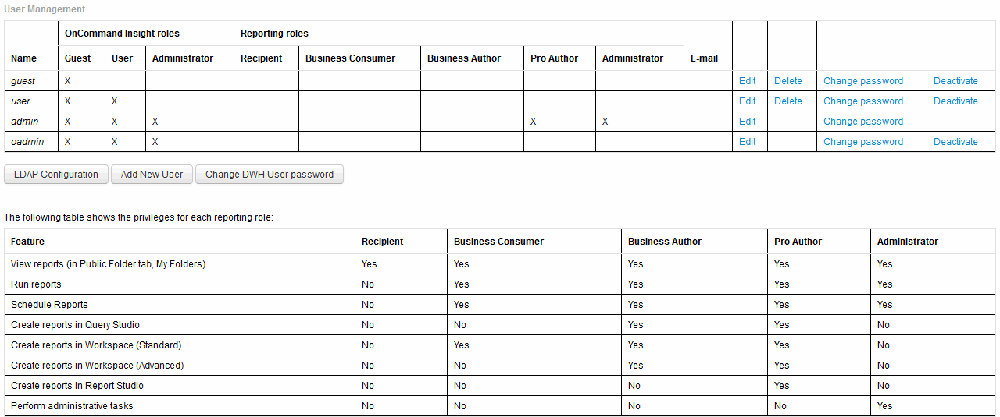

= 管理使用者帳戶
:allow-uri-read: 
:icons: font
:imagesdir: ../media/

[role="lead"]
您可以從Data倉儲入口網站設定使用者帳戶、使用者驗證及使用者授權。每個使用者帳戶都會被指派一個具有下列其中一個權限等級的角色。使用者數量受限於附加至每個角色的報告授權數量。

== 步驟

. 登入資料倉儲入口網站： `+https://hostname/dwh+`、其中 `hostname` 是OnCommand Insight 安裝了IsName Data倉儲的系統名稱。
. 在左側的導覽窗格中、按一下*使用者管理*。
+

. 執行下列其中一項：
+
** 若要編輯現有的使用者、請選取該使用者的列、然後按一下*編輯*。
** 若要變更使用者密碼、請選取該使用者的列、然後按一下*變更密碼*。
** 若要刪除使用者、請選取該使用者的列、然後按一下*刪除*

. 若要啟動或停用使用者、請選取該使用者的列、然後按一下*啟動*或*停用*。

