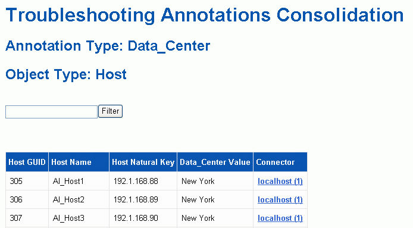

= 解決多個伺服器附註整合問題
:allow-uri-read: 
:icons: font
:imagesdir: ../media/

[role="lead"]
「資料倉儲疑難排解」檢視中的「註釋合併」檢視會顯示一個表格、其中包含所有可用的註釋類型、以及可套用註釋類型的物件類型。

== 關於這項工作

註釋值的整合是根據註釋類型的值而定。儲存陣列可能有兩個不同的層級值、每個值來自不同的連接器。因此、如果在一個連接器中有一個名稱為gold的階層、而在第二個連接器中有一個名稱為goldy的階層、則此資訊會以兩個不同的階層顯示在Data倉儲中。

由於某些註釋類型允許將多個註釋值指派給同一個物件、因此Data倉儲允許物件（例如、「主機」）指派多個註釋值給它們（例如、「datacenter 1」和「datacenter 2」可以指派給同一個主機）。

Volume上的階層註釋功能與一般註釋表格有些不同。環境中可能有大量的磁碟區、而在Data倉儲中顯示所有磁碟區、可能會影響資訊的使用性。因此、「註釋合併」檢視只會顯示指派多個層級值的磁碟區、以及包含每個此類磁碟區的儲存區。

== 步驟

. 登入資料倉儲入口網站： `+https://hostname/dwh+`、其中 `hostname` 是OnCommand Insight 安裝了IsName Data倉儲的系統名稱。
. 在左側的導覽窗格中、按一下*疑難排解*。
. 在「*註釋合併*」區段中、按一下物件列中的「*顯示*」。
+
以下是Data_Center註釋的範例：

+

