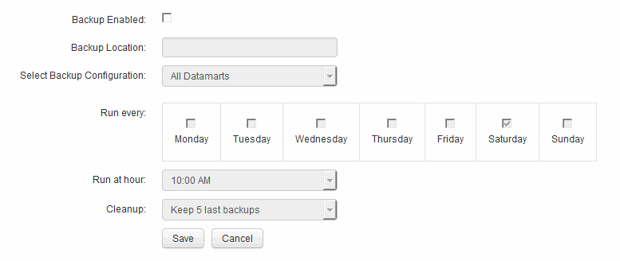

= 排程每日備份
:allow-uri-read: 
:icons: font
:imagesdir: ../media/

[role="lead"]
雖然您可以隨時使用備份/還原控制項來手動備份Data倉儲、但最佳做法是排程自動備份、定義備份Data倉儲資料庫和Cognos內容儲存區的時間和頻率。備份可防止資料遺失、讓您在需要時還原資料倉儲資料庫。您也可以在移轉至新的Data倉儲伺服器或升級至新的Data倉儲版本時使用備份。

== 關於這項工作

在資料倉儲伺服器不忙碌的情況下排程備份、可改善備份效能、並減少對使用者的影響。

== 步驟

. 登入資料倉儲入口網站： `+https://hostname/dwh+`、其中 `hostname` 是OnCommand Insight 安裝了IsName Data倉儲的系統名稱。
. 在左側的導覽窗格中、按一下*排程*。
. 在*備份排程*對話方塊中、按一下*編輯*以新增排程。
+

. 若要啟用排定的備份、請選取*啟用備份*。
. 指定您要儲存備份檔案的位置。
. 指定您要備份的資料。
. 指定您要執行備份的日期或天數。
. 指定您要開始備份的時間。
. 指定您要保留多少份過去的備份複本。
. 按一下「 * 儲存 * 」。

