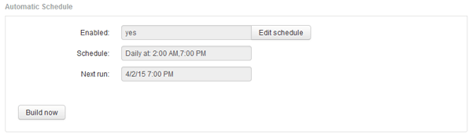
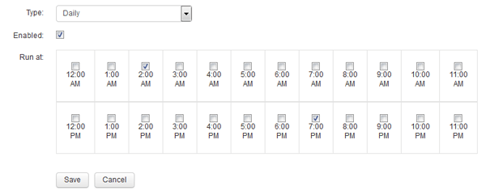

= 排程每日建置
:allow-uri-read: 
:icons: font
:imagesdir: ../media/

[role="lead"]
雖然您可以隨時使用「立即建置」控制項手動建置資料倉儲、但最佳做法是排程自動建置、定義建置資料倉儲資料庫的時間和頻率。Data倉儲會針對每個連接器和每個資料倉儲執行建置工作。資料倉儲會針對每個連接器執行建置工作、以處理授權與庫存、而所有其他建置工作（例如容量）則會在整合式資料庫上執行。

== 關於這項工作

無論何時建置資料倉儲、它都會為每個連接器執行庫存作業。完成庫存工作後、Data倉儲會執行維度、容量及剩餘資料目標的工作。

== 步驟

. 登入資料倉儲入口網站： `+https://hostname/dwh+`、其中 `hostname` 是OnCommand Insight 安裝了IsName Data倉儲的系統名稱。
. 在左側的導覽窗格中、按一下*編輯排程*。
+

. 在「*建置排程*」對話方塊中、按一下「*編輯*」以新增排程。
+

. 選擇每週頻率。
. 選擇您希望工作每天執行的時間。
. 選擇「不適用」、表示您不想執行建置的天數。
. 若要啟用排程、請選取*已啟用*。
+
[NOTE]
====
如果您未核取此選項、則不會建立排程。

====
. 按一下「 * 儲存 * 」。
. 若要在自動排程建置之外建置資料倉儲、請按一下*立即建置*。

