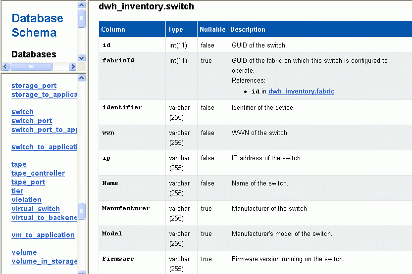
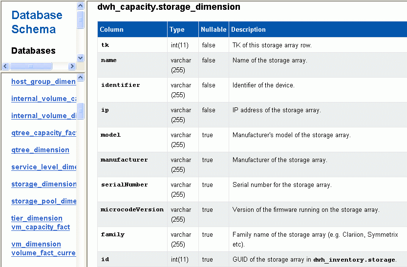

= 在資料庫架構中顯示註釋變更
:allow-uri-read: 
:icons: font
:imagesdir: ../media/

[role="lead"]
資料庫架構會反映特定表格中的變更。

== 關於這項工作

例如、如果您將附註新增至儲存陣列、這些附註會顯示在庫存或其他資料集市的儲存或交換器表格中。

如果您使用OnCommand Insight 支援資源的使用者介面更新註釋、並啟動或等待下一個Data倉儲建置、您會在庫存（dwh_inventory）和對應的維度表中、看到新增或移除的欄 （在適當的資料倉儲中）。您會在下列表格中看到結果：

* dwh_inventory.annotation_value
* dwh_inventory.object_to_dotannotation

== 步驟

. 按一下 image:../media/oci-7-help-icon-gif.gif[""] 在Data倉儲工具列上、選取* Documentation *。
. 選擇*資料庫架構*。
. 在左側的「*資料庫架構*」窗格中、捲動至「* DWH_inventory*」區段、然後按一下「* switch*」。
+

. * dwh_inventory.switch*表格會反映下列變更：
+

+
資料中心附註欄會出現在「儲存空間維度」表格中。

