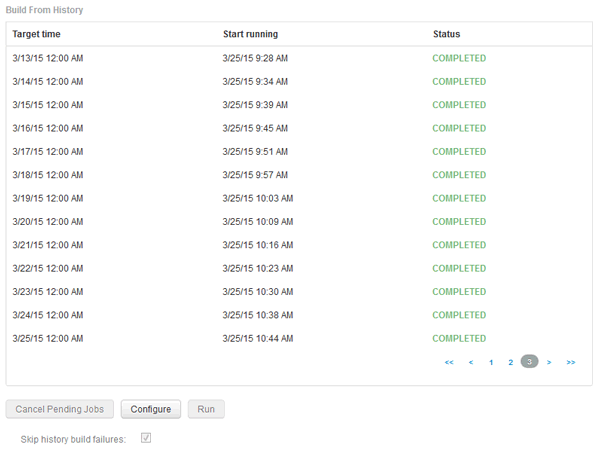

= 跳過失敗的建置
:allow-uri-read: 
:icons: font
:imagesdir: ../media/

[role="lead"]
第一次建置之後、有時可能會遇到建置失敗的情況。若要確保成功完成建置失敗後的所有工作、您可以啟用*跳過建置歷程失敗*選項。

== 關於這項工作

如果建置失敗且啟用*跳過歷史建置失敗*選項、資料倉儲會繼續建置、忽略任何失敗的建置。如果發生這種情況、任何跳過的建置都不會在歷史資料中有資料點。

只有在建置不成功時才使用此選項。

如果建置失敗於「從歷史建置」中、且未選取「*跳過歷史建置失敗*」核取方塊、則所有後續工作都會中止。

== 步驟

. 登入資料倉儲入口網站： `+https://hostname/dwh+`、其中 `hostname` 是OnCommand Insight 安裝了IsName Data倉儲的系統名稱。
. 在左側的導覽窗格中、按一下*從歷史記錄建置*。
+

. 按一下「*設定*」。
. 設定建置。
. 按一下「 * 儲存 * 」。
. 若要跳過失敗的建置、請查看*跳過歷史建置失敗*。
+
只有在*執行*按鈕已啟用時、才能看到此核取方塊。

. 若要在自動排程建置之外執行建置、請按一下「*執行*」。

