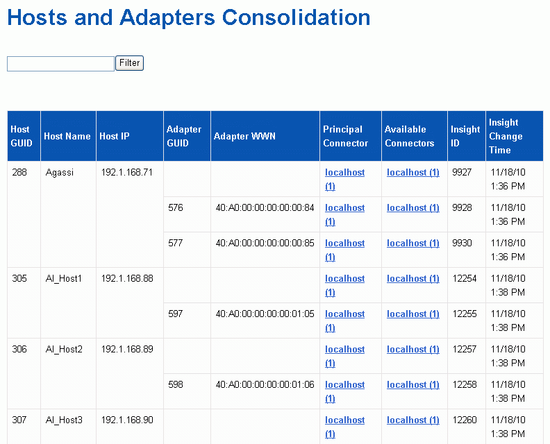

= 檢視主機和介面卡整合問題
:allow-uri-read: 
:icons: font
:imagesdir: ../media/

[role="lead"]
主機及其相關介面卡的報告資料是從Inventory Data mart衍生而來。

== 步驟

. 登入資料倉儲入口網站： `+https://hostname/dwh+`、其中 `hostname` 是OnCommand Insight 安裝了IsName Data倉儲的系統名稱。
. 在左側的導覽窗格中、按一下*疑難排解*。
. 在*機箱整合*區段中、按一下*主機與介面卡*。
+
[NOTE]
====
本範例所示的組態不是有效的組態。localhost上的主要和可用連接器表示Insight伺服器和DWH都安裝在同一部伺服器上。本範例旨在讓您熟悉整合表。

====
+

+
對於所有主機和介面卡、每個報告的連接器都有一列、以及用於接收主機和介面卡的主要連接器。僅針對主機和介面卡、一個連接器回報的主機可能會有不同的連接器回報其介面卡。

+
您也可以查看OnCommand Insight 每個連接器的主機/介面卡的更新時間。使用此參數、您可以發現OnCommand Insight 在更新主機/介面卡時、主機/介面卡何時發生更新、以及在其他OnCommand Insight 的伺服器中更新相同的主機/介面卡時。

. 您也可以輸入一部分文字、然後按一下*篩選*來篩選此檢視中的資料。若要清除篩選條件、請刪除*篩選條件*方塊中的文字、然後按一下*篩選條件*。您可以依主機名稱、主機IP、介面卡WWN或OnCommand Insight 物件ID進行篩選。
+
篩選器區分大小寫。

. 檢閱下列資料：
+
** *主機GUID*
+
此類整合式裝置（主機）的全域唯一識別碼

** *主機名稱*
+
合併主機在資料倉儲中的名稱

** *主機IP*
+
整合主機的IP位址

** *介面卡GuID*
+
主機介面卡的全域唯一識別碼

** *介面卡WWW*
+
主機介面卡的WWN

** *主要連接器*
+
實際資料來源的連接器名稱OnCommand Insight

** *可用的連接器*
+
整合式主機/介面卡所在的所有OnCommand Insight 支援連接器

** * Insight ID*
+
相關報告連接器的整合式主機/介面卡ID OnCommand Insight

** * Insight變更時間*
+
當更新主機/介面卡時、以及在其他的BIOS伺服器中更新相同的主機/介面卡時OnCommand Insight OnCommand Insight

. 若要取得連接器的詳細資訊、請按一下連接器。
+
您可以看到下列連接器資訊：

+
** 主機名稱
** 上次在該連接器上執行資料倉儲工作的時間
** 上次從該連接器收到變更的時間
** 該連接器指向的版本的伺服OnCommand Insight 器

