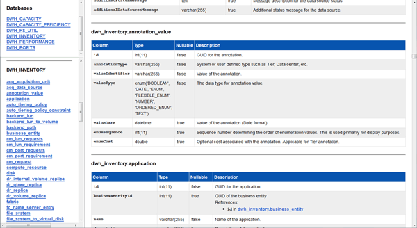

= 檢視資料倉儲資料庫架構
:allow-uri-read: 
:icons: font
:imagesdir: ../media/

[role="lead"]
您可能想要檢視資料庫架構、以瞭解如何使用其他API中的資料、或是開發SQL查詢。架構選項會列出架構中的所有資料庫、表格和欄。您也可以檢閱顯示資料表關聯的資料庫架構圖表。

== 步驟

. 登入資料倉儲入口網站： `+https://hostname/dwh+`、其中 `hostname` 是OnCommand Insight 安裝了IsName Data倉儲的系統名稱。
. 按一下  在Data倉儲工具列上、選取* Documentation *。
. 選擇*資料庫架構*。
. 例如、在*資料庫*窗格中、按一下* DWH_inventory*。
. 在*所有表格*窗格中、向下捲動至* DWH_inventory*區段、然後按一下*註釋_Value*表格。
+

+
此時會出現dwh_inventory.annotation表格。

