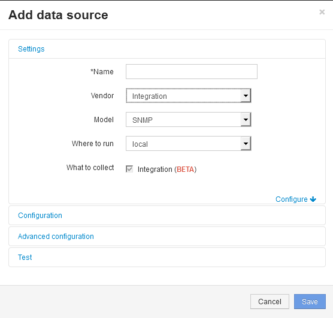

= 建立SNMP整合資料來源
:allow-uri-read: 
:icons: font
:imagesdir: ../media/

[role="lead"]
整合SNMP資料來源提供通用的SNMP組態內容、類似OnCommand Insight 於Brocade和Cisco的《支援資訊》資料來源隨附的其他SNMP型資料來源。

== 開始之前

若要成功使用整合SNMP資料來源來收集資料、必須符合下列條件：

* 您必須已匯入要用於此SNMP資料來源的整合套件。
* 所有目標裝置都共用相同的認證資料。
* 所有目標裝置都會實作所設定整合套件所參照的SNMP物件。

== 關於這項工作

若要建立SNMP整合資料來源、請在資料來源建立精靈中選擇廠商「整合」和型號「SNMP」。

== 步驟

. 在這個Web UI中、按一下OnCommand Insight *管理*>*資料來源*
. 按一下「*+附加*」
. 輸入資料來源的名稱
. 對於廠商、請選取* Integration *
. 在「Model（型號）」中、選取「* SNMP *」
+

. 如需收集內容、請查看* Integration *
+
這是此資料來源上唯一的套件、預設為核取：

. 按一下*組態*
. 輸入要從中收集SNMP資料的系統IP位址
. 選取匯入的SNMP整合套件
. 設定整合意見調查時間間隔
. 選取SNMP版本
. 輸入SNMP社群字串
+
適用於SNMP V1和V2。

. 新增您要從中收集資料的系統的使用者名稱和密碼。
+
適用於SNMP V3。

. 按一下*進階組態*
+
此時會顯示「進階組態」預設設定。對這些必要的設定進行任何變更。

