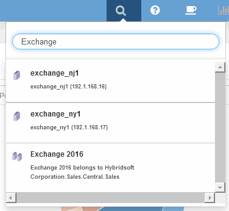
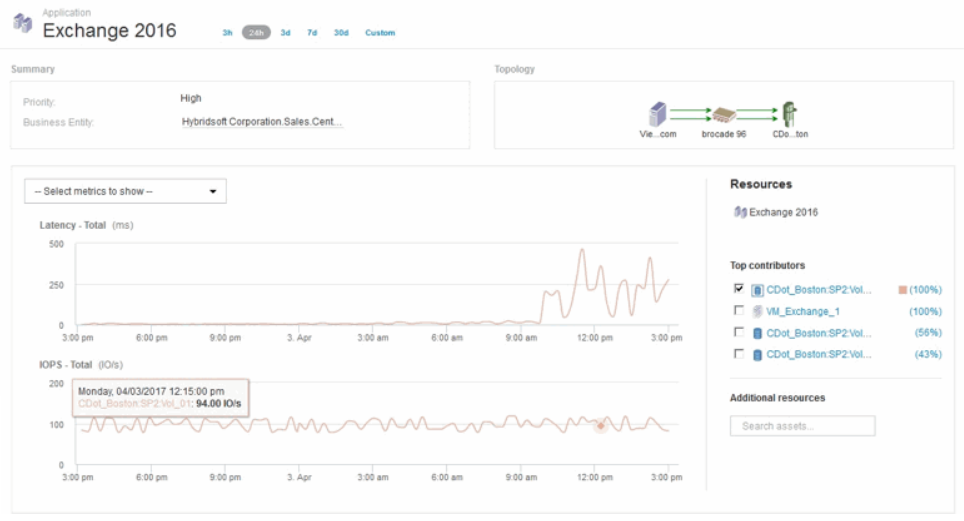
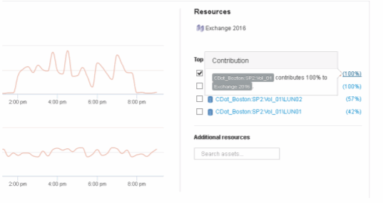

= 分析應用程式效能問題
:allow-uri-read: 
:icons: font
:imagesdir: ../media/

[role="lead"]
本文件說明您可能採取的步驟、以解決影響使用者或系統管理員之應用程式效能問題的報告。例如、使用者抱怨他們的Exchange應用程式一整天都在緩慢運作。

== 關於這項工作

在支援中、應用程式是已設定的實體OnCommand Insight 。您可以為應用程式指派名稱和企業實體、並將運算和儲存資源指派給應用程式。如此一來、您就能更清楚地瞭解基礎架構健全狀況、並更主動地管理基礎架構資產。

== 步驟

. 若要開始調查問題、請使用Insight工具列執行Exchange應用程式的全域搜尋。
+

+
[TIP]
====
執行搜尋時、您可以在物件名稱之前新增物件描述元、以精簡搜尋結果。

====
. 當您從搜尋結果中選取「Exchange 2016」時、系統會顯示「應用程式」登陸頁面。
+

+
在「應用程式」登陸頁面中、您會感興趣下列資訊：

+
** 在所選的24小時期間內、延遲圖右側會顯示延遲增加的情形。
** 在延遲增加期間、IOPS層級並無重大改變。延遲增加似乎不是因為應用程式使用量增加所致。我們並未發現儲存設備的IOPS需求過高、可能導致延遲尖峰。延遲增加可能是因為外部因素所致。
** 在圖表右側的「貢獻者排行」區段中、按一下所選內部磁碟區的100%（CDot_波士頓：SP2：Vol _01）。系統顯示此資源為Exchange 2016應用程式貢獻100%。 
** 按一下此內部磁碟區的導覽連結（CDot_Boston：SP2：Vol（Vol）01）以存取內部磁碟區登陸頁面。內部磁碟區的分析可能會提供有關延遲尖峰的資訊。

