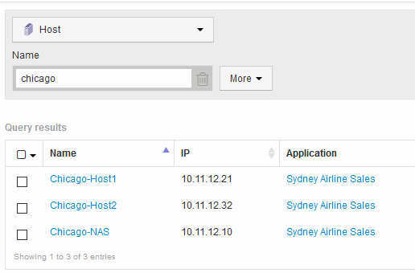
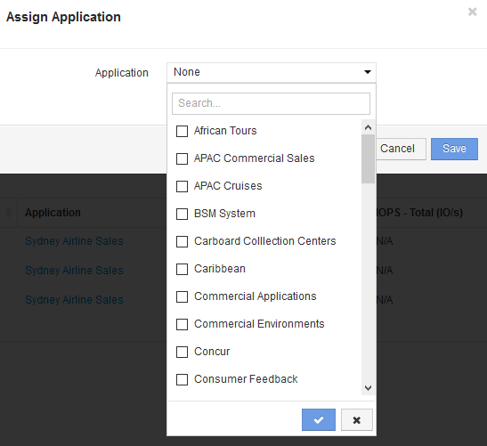

= 使用查詢將應用程式指派給資產
:allow-uri-read: 
:icons: font
:imagesdir: ../media/

[role="lead"]
您可以將應用程式指派給資產、以便識別應用程式使用的資產資源。如果資產已指派成本給該資產、您可以識別應用程式所產生的成本、如果資源是根據規模來衡量、您可以判斷是否需要補充該資源。

== 關於這項工作

您可以使用查詢來簡化將多個資產指派給應用程式的工作。

== 步驟

. 建立新的查詢、以識別您要指派應用程式的資產。例如、如果您要將其指派給與地理位置相關的特定名稱主機、請按一下*查詢*>*+新查詢*
. 按一下*主機*
. 在*名稱*欄位中、輸入 `Chicago`
+
系統會使用顯示所有主機 `Chicago` 如果是他們的名字、 

. 選取查詢所識別的一或多個主機。
. 按一下「*動作*」>「*新增應用程式*」
+

+
系統會顯示指派應用程式對話方塊。

. 選取您要指派給主機的應用程式、然後按一下 image:../media/check-box-ok.gif[""]
. 按一下「*儲存*」
+
應用程式名稱會出現在「使用者資料」區段中。

