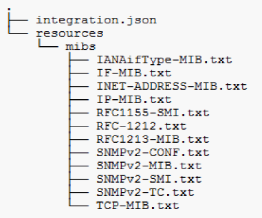

= 收集SNMP整合資料
:allow-uri-read: 
:icons: font
:imagesdir: ../media/

[role="lead"]
整合SNMP資料來源可讓您在OnCommand Insight 支援中收集一般SNMP資料。

== 整合套件

SNMP整合資料來源使用「Integration Pack」來定義所收集的整合值、以及SNMP物件提供的值。

整合套件包含：

* Json組態檔（積分.json）、以特定裝置類型（交換器、路由器等）的SNMP物件定義整合有效負載內容。
* 整合套件所依賴的mib檔案清單。

整合套件可定義多種資料類型。例如、整合RHEL主機時、可針對一般系統資訊定義資料類型、例如正常運作時間、使用者人數及執行中的處理程序數量、也可針對記憶體和檔案系統使用量的資料定義第二種資料類型。一般而言、每種資料類型都必須是「flat」、且不得包含巢狀資料。

單一整合套件不得定義超過24種資料類型。Insight可限制所收集的整合資料量。在一分鐘內嘗試擷取超過24份報告、會導致費率錯誤。

整合類型的名稱必須符合下列規則：

* 名稱不能以下列字元開頭：_、-或+
* 名稱不得包含下列字元：#、\、/、*、？、 "、<、>、|、'、 ’、
* 不能超過100個utf-8編碼位元組
* 無法命名。或..

== 整合檔案格式

整合套件是一個ZIP檔案、其中包含一個Json組態檔（積分.json）、可定義SNMP物件的整合有效負載內容。它也包含MIBS資料夾、其中包含所有的mib檔案及其mib相依性。

。 `integration.json` 檔案必須存在於ZIP檔案的最上層、且必須存在於ZIP內的「資源/ MIBs」子目錄中。如有需要、ZIP檔案也可能包含「readme.txt」等檔案。整合郵遞區號結構的範例包括：

