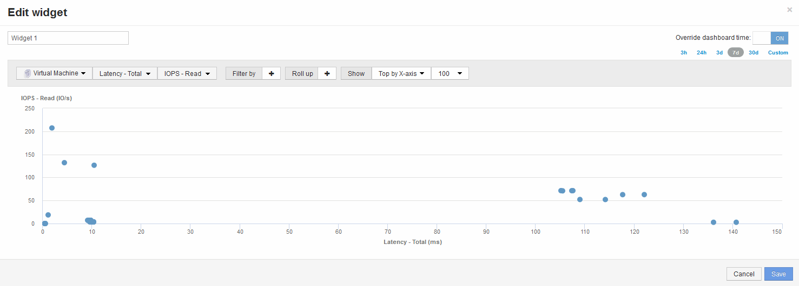

= 比較指標A與指標B、以顯示類別和異常狀況
:allow-uri-read: 
:icons: font
:imagesdir: ../media/

[role="lead"]
您可以使用散佈圖來顯示每個物件的兩組資料。例如、您可以為每個物件指定要顯示的IOPS讀取和延遲總計。使用此圖表、您可以根據IOPS和延遲組合、找出您認為有問題的物件。

== 步驟

. 將內含散佈圖圖表的小工具新增至新儀表板：*小工具*>*散點圖*
. 將預設裝置變更為虛擬機器：按一下「*儲存設備*>*虛擬機器*>*延遲總計*」>「* IOPS讀取*」
+
系統會顯示類似下列的散佈繪圖： 

