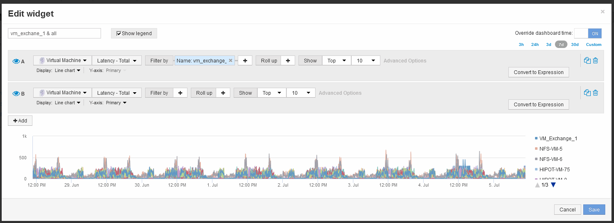

= 比較一個物件的延遲總和與前10大物件的延遲總和
:allow-uri-read: 
:icons: font
:imagesdir: ../media/

[role="lead"]
下列步驟將單一VM的延遲總計與報告整個虛擬基礎架構前10大延遲總計的VM進行比較。

== 步驟

. 將含折線圖的小工具新增至新儀表板：*小工具*>*折線圖*
+
.. 將預設裝置變更為虛擬機器：按一下*儲存設備*>*虛擬機器*>*延遲總計*
+
Widget會顯示區域圖中所有VM預設24小時的總延遲時間。

.. 在此小工具中建立第二個顯示、顯示所有VM的平均延遲總和：*小工具*>*折線圖*
.. 將預設裝置變更為虛擬機器：按一下「*儲存設備*>*虛擬機器*」>「*延遲-總計*」
+
Widget會使用折線圖顯示預設24小時期間的延遲總計。

.. 按一下*捲動*列上的* X*、然後選取*顯示*>*頂端*>* 10 *

+
系統會根據延遲-總計顯示前10大VM。 

. 新增您要與前10大比較的VM：
+
.. 按一下「*+附加*」
.. 將預設裝置變更為虛擬機器：按一下*儲存設備*>*虛擬機器*>*延遲總計*
.. 按一下*篩選條件*>*名稱*>*$var1*

. 按一下*顯示圖例*

== 結果

圖例會識別分析中的每個VM。您可以輕鬆識別VM_Exchange 1、並判斷其延遲是否與環境中前十大VM類似。
