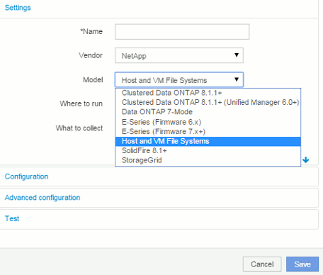
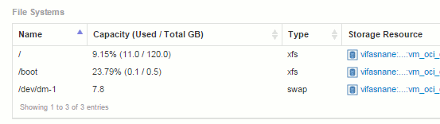

= 設定Insight以供檔案系統集合使用
:allow-uri-read: 
:icons: font
:imagesdir: ../media/

[role="lead"]
若要設定Insight以收集檔案系統使用率資料、您必須安裝Host utilization Pack授權、並設定NetApp Host和VM File Systems資料來源。

== 開始之前

如果您尚未安裝主機使用率套件授權、請安裝此授權。您可以在「*管理*>*設定*」頁面的「*授權*」索引標籤中查看授權。

Host and VM File Systems資料來源僅報告目前在Insight中收集或探索的已知*運算資源*（主機和VM）的檔案系統使用率和檔案系統中繼資料：

* 虛擬機器是由Hypervisor資料來源（例如Hyper-V和VMware）所收集。
* 主機是透過裝置解析度來探索。

適當的儲存資源上必須有適當的階層註釋。

支援下列連接的區塊儲存裝置：

* NetApp叢集Data ONTAP 式解決方案（cDOT）
* NetApp 7-Mode
* CLARiiON
* Windows：適用於FC、iSCSI的VMware虛擬磁碟（VMDK）
* Linux：VMware VMDK（不支援iSCSI和FC）

「運算資源群組」*是一種註釋、可讓共用通用管理認證的主機和/或虛擬機器進行群組。

== 步驟

. 首先、在要納入*運算資源群組*的主機和/或虛擬機器上加上註釋。移至*查詢*>*+新查詢*、然後搜尋_Virtual Machine資產。
+
您必須針對_Host_資產重複這些步驟。

. 按一下表格右側的欄選取器、然後選取*運算資源群組*欄、將其顯示在查詢結果表格中。
. 選取您要新增至所需運算資源群組的虛擬機器。您可以使用篩選器來搜尋特定資產。
. 按一下「*動作*」按鈕、然後選擇「*編輯註釋*」。
. 選取_運算資源群組_註釋、然後在_值_欄位中選擇所需的資源群組名稱。
+
資源群組附註會新增至選取的VM。資源群組名稱必須符合您稍後在主機和VM檔案系統資料來源中設定的名稱。

. 若要設定運算資源群組的主機和VM檔案系統資料來源、請按一下*管理*>*資料來源*和*新增*_NetApp主機和VM檔案系統_資料來源。
+

. 在「*組態*」區段中、針對具有擷取檔案系統資料適當權限的作業系統使用者、輸入*使用者名稱*和*密碼*。對於Windows作業系統使用者、如果您的Windows環境使用網域首碼、則必須包含網域首碼。
+
請注意、安裝在Linux上的Insight採購單位（AU）可回報Linux運算資源、而安裝在Windows上的AU則可與Linux或Windows運算資源進行對話。

. 輸入您要從中收集檔案系統使用率資料的資產*運算資源群組*名稱。此名稱必須符合您用來註釋上述資產的資源群組名稱。
+
如果您將「運算資源群組」欄位保留空白、則資料來源會收集沒有「運算資源群組」註釋的主機或VM的資料。

. 在「**進階組態」區段中、輸入此資料來源所需的輪詢時間間隔。預設的6小時通常是足夠的。
. 建議在儲存資料來源連線之前先*測試*。成功的連線結果也會顯示群組中包含多少運算資源目標。
. 按一下「 * 儲存 * 」。Host和VM File Systems資料來源將於下次輪詢時開始收集資料。
. 收集檔案系統資料後、您可以在主機或VM的資產頁面上、於檔案系統小工具中檢視：
+

. 針對您將擁有的每個運算資源群組重複這些步驟。每個運算資源群組都必須與其自己的主機和VM檔案系統資料來源建立關聯。
+
請注意、系統會針對環境中任何傳統VMware或Hyper-V資料來源所取得的主機和VM收集檔案系統資訊。

