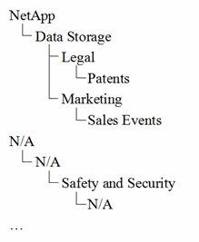

= 為貴公司設定商業實體
:allow-uri-read: 
:icons: font
:imagesdir: ../media/

[role="lead"]
瞭解企業架構的業務要素、有助於追蹤資產使用狀況、並報告成本。我們將在此設定貴公司的業務實體。

== 關於這項工作

利用此功能、您可以定義階層中最多包含四個精細度層級的商業實體OnCommand Insight 。

* *租戶*
+
主要由服務供應商用來將資源與客戶建立關聯。如果貴公司是ISP、而且您想要追蹤客戶的資源使用量、則需要租戶層級。

* *業務線（LOB）*
+
公司內部的業務線或產品線、例如資料儲存設備。如果需要追蹤不同產品線的資料、階層中就需要業務線。

* *業務單位*
+
代表法務或行銷等傳統業務單位。如果您需要追蹤不同部門的資料、則需要業務單位。在分隔某個部門使用的資源（其他部門不使用的資源）時、這種階層層級通常非常重要。

* *專案*
+
通常用於識別業務單位內您想要容量計費的特定專案。例如、「專利」可能是法律業務單位的專案名稱、而「銷售活動」可能是行銷業務單位的專案名稱。請注意、層級名稱可能包含空格。

企業實體階層架構的範例包括：

最佳實務做法：建立表格、每列顯示階層架構中的一個完整企業實體：

|===

| 租戶 | 業務線 | 業務單位 | 專案 

 a| 
NetApp Inc.
 a| 
資料儲存
 a| 
合法
 a| 
專利

 a| 
NetApp Inc.
 a| 
資料儲存
 a| 
行銷
 a| 
銷售活動

 a| 
不適用
 a| 
不適用
 a| 
安全性
 a| 
不適用

 a| 
...
 a| 
 a| 
 a| 

|===
[NOTE]
====
您不需要使用公司階層架構設計中的所有層級。您可以針對不使用的層級選擇「N/A」。

====
若要在Insight中建立企業實體階層架構：

== 步驟

. 以具有管理權限的使用者身分登入Insight。
. 選擇*管理*>*商業實體*。
. 按一下「*+附加*」按鈕
. 按一下「*租戶*」方塊、然後輸入租戶名稱。
+
如果您已輸入環境的租戶、則會出現一份現有租戶清單、供您選擇。如果租戶不適用於此企業實體、您也可以選擇N/A。

. 重複執行*業務單位*、*業務單位*和*專案*。
. 按一下「*儲存*」

== 完成後

最佳實務做法：

* 在資料表中規劃您的業務階層、並在Insight視圖和報告中檢查階層中的名稱是否可以自行解釋。
* 在建立應用程式之前、請先在Insight中建立您的企業實體。
* 識別並列出與每個企業實體相關的所有應用程式。

