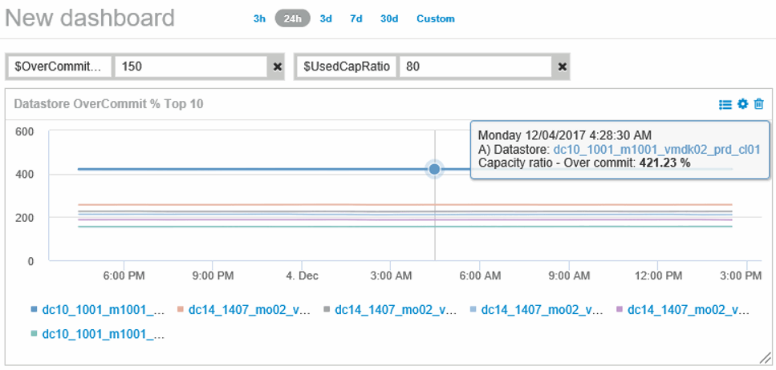
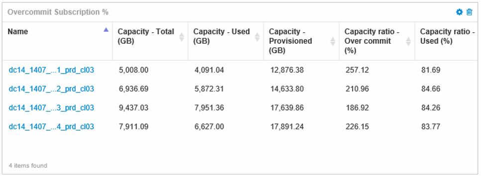
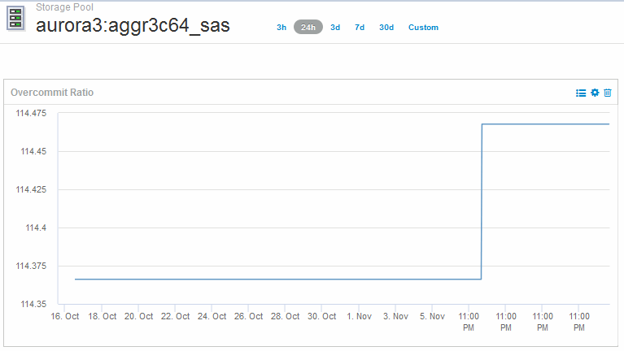

= 建立儀表板以監控精簡配置的環境
:allow-uri-read: 
:icons: font
:imagesdir: ../media/

[role="lead"]
利用NetApp Insight靈活的儀表板小工具設計與顯示圖表選項、您可以深入分析容量使用率與使用率、以及將精簡配置資料中心基礎架構的風險降至最低的策略資訊OnCommand 。

您可以建立儀表板、以便存取您要監控的資料存放區和儲存資源池資訊。

== 使用儀表板存取資料存放區資訊

您可能想要建立儀表板、以便快速存取您要在虛擬基礎架構中監控的資料。儀表板可包含類似下列的小工具、以根據資料存放區的過度使用百分比來識別前10大資料存放區、並提供顯示資料存放區容量資料的小工具。儀表板會使用變數來強調超過150%的資料存放區和超過80%已使用容量的資料存放區。

可用於監控精簡配置環境的其他小工具可能包含下列部分資訊：

* 與資料存放區相關的VMDK容量
* VM容量
* 資料儲存容量使用趨勢

== 使用儀表板存取儲存池資訊

儀表板可包含類似下列的小工具、識別使用的實體儲存容量、或識別儲存資源池的過度使用容量。

