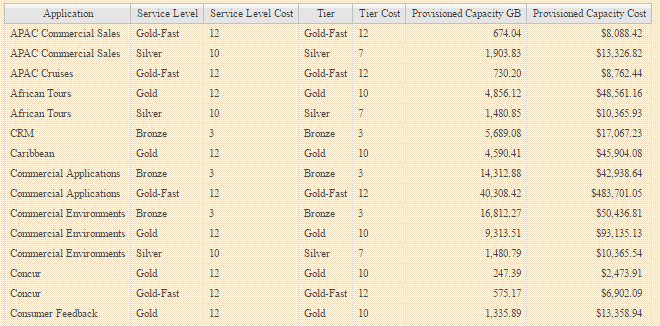

= 建立簡單的計費報告
:allow-uri-read: 
:icons: font
:imagesdir: ../media/

[role="lead"]
計費報告可讓系統管理員和經理根據應用程式、企業實體、服務層級和層級來評估容量使用量。計費報告包括容量責任、歷史容量責任及趨勢資料。這些報告的資料是OnCommand Insight 從《The支援資料倉儲（The NetApp Data Warehouse）」建置和排程的。

== 開始之前

若要建立範例報告、您的系統必須設定為報告儲存層的成本。下列工作必須完成：

* 定義階層的註釋。
* 將成本指派給附註。
* 定義您要追蹤資料的應用程式。
* 將應用程式指派給資產。

== 關於這項工作

此範例使用Cognos Workspace進階報告工具來建立計費報告。有了Workspace Advanced、您可以將資料元素拖放到報告面板中來建立報告。

== 步驟

. 在這個Web UI中、按一下報告圖示OnCommand Insight 。
. 登入報告入口網站。
. 在IBM Cognos連線工具列中、按一下*啟動*>* Cognos工作服務進階*
+
「工作區進階」套件畫面隨即開啟。

. 按一下「*套件*>*計費*」
+
隨即顯示IBM Workspace Advanace畫面。

. 按一下「*新增*」
. 在「*新增*報告」對話方塊中、按一下「*清單*」以指定清單報告。
+
系統會顯示報告面板、而「來源」標題下方會顯示「Chargeback」「Simple data mart」（組資料倉儲）和「Advanced data mart」（進階資料倉儲）。

. 按一下每個資料倉儲旁的箭頭加以展開。
+
顯示資料集市的完整內容。

. 將「應用程式」從「簡易資料庫」拖曳到報告面板最左欄。
+
當您將項目拖曳至色盤時、欄會縮小並反白顯示。將應用程式資料放入反白欄中、會導致欄中正確列出所有應用程式。

. 將「層級」從「簡易資料庫」拖曳到報告面板的下一欄。
+
與每個應用程式相關聯的儲存層會新增至色盤。

. 將「層級成本」從「簡易資料庫」拖曳到報告面板的下一欄。
. 將「已配置的容量」從「簡易資料庫」拖曳到報告面板的下一欄。
. 按住* Ctrl*鍵、然後選取貨盤中的「層成本」和「已配置容量」欄。
. 在任一選取的欄位中按一下滑鼠右鍵。
. 按一下「*計算*>*層級成本*已配置的容量DB*」
+
新增一欄至貨盤、標題為「層成本*資源配置容量GB」。

. 在「*層級成本*資源配置容量GB*」欄上按一下滑鼠右鍵。
. 按一下*樣式*>*資料類型*
. 按一下*格式類型*>*貨幣*
. 按一下「*確定*」
+
欄資料現在格式為美國貨幣。

. 在「層級成本*資源配置容量GB」上按一下滑鼠右鍵、然後選取*編輯資料項目標籤*
. 將「Name（名稱）」欄位取代為「已配置的容量成本」
. 若要執行報告、請按一下*執行*>*執行報告- HTML*
+
此時會顯示類似下列的報告。 

