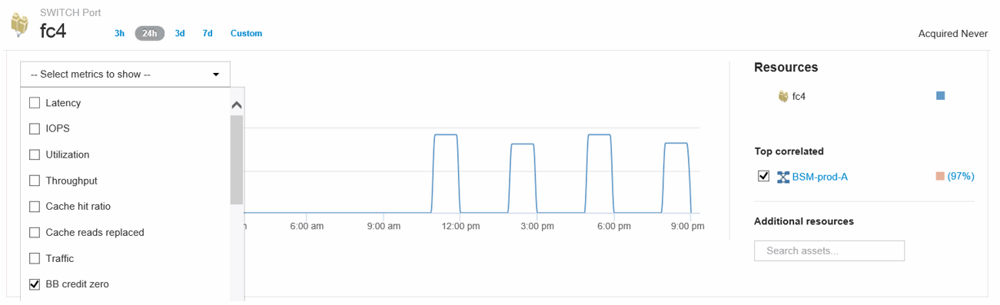
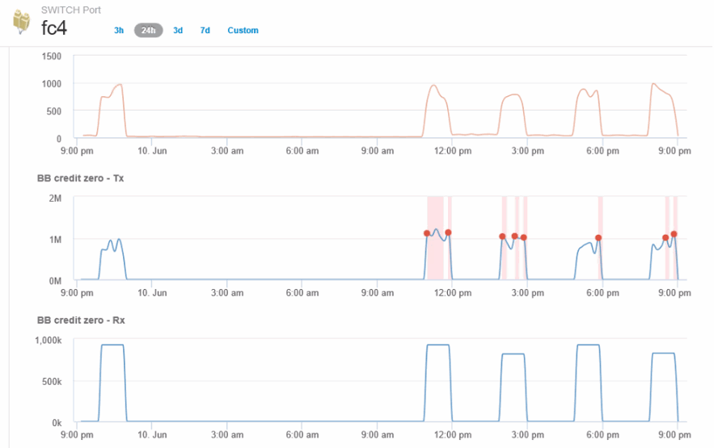
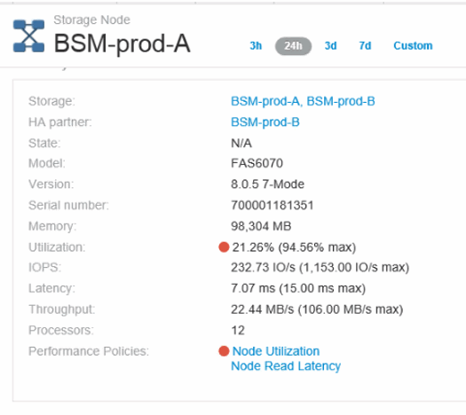
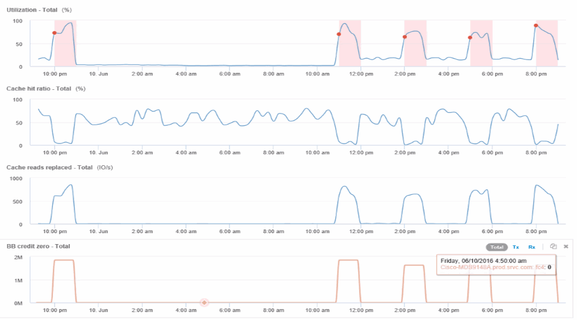

= 建立連接埠的效能原則和臨界值
:allow-uri-read: 
:icons: font
:imagesdir: ../media/

[role="lead"]
您可以針對與連接埠相關的度量建立具有臨界值的效能原則。根據預設、效能原則會套用至建立指定類型的所有裝置。您可以建立附註、以便在效能原則中僅包含特定裝置或一組裝置。為了簡化、本程序不使用註釋。

== 開始之前

如果您想要在這個效能原則中使用附註、則必須先建立附註、然後再建立效能原則。

== 步驟

. 在Insight工具列中、按一下*管理*>*效能原則*
+
此時會顯示現有原則。如果交換器連接埠有原則存在、您可以編輯現有原則、新增原則和臨界值。

. 編輯現有的連接埠原則或建立新的連接埠原則
+
** 按一下現有原則最右側的鉛筆圖示。新增步驟「d」和「e」所述的臨界值。
** 按一下「*+新增*」以新增原則
+
... 新增「Policy Name（原則名稱）」：Slow Slow Device
... 選取連接埠做為物件類型
... 在的「Apply after window'（在視窗之後套用）」中輸入第一次出現的項目
... 輸入臨界值：BB積分為零-接收大於100、000、000
... 輸入臨界值：BB積分零- Tx> 100、000
... 按一下「在產生警示時處理更多原則」
... 按一下「儲存」

+
您建立的原則會監控您在24小時內設定的臨界值。如果超過臨界值、就會報告違規。

. 按一下*儀表板*>*違規儀表板*
+
系統會顯示系統上發生的所有違規。搜尋或排序違規事件、以查看「低排放裝置」違規事件。違規儀表板會顯示發生超過效能原則所設定臨界值的所有發生BB Credit 0錯誤的連接埠。違規儀表板中識別的每個交換器連接埠都是連接埠登陸頁面的反白連結。

. 按一下反白顯示的連接埠連結以顯示連接埠登陸頁面。
+
隨即顯示連接埠登陸頁面、其中包含許多資訊、可協助您疑難排解B-Credit 0：

+
** 連接埠所連接的裝置
** 報告違規事件的連接埠識別（光纖通道交換器連接埠）。
** 連接埠的速度
** 關聯的節點和連接埠名稱image:../media/port-landing-page.gif[""]

. 向下捲動以檢視連接埠度量。按一下「*選取要顯示的指標*>*「BB積分零」*以顯示寬帶點數圖表。
+

. 按一下*頂端關聯*
+
最高關聯資源分析顯示連接埠所服務的控制器節點、是與效能最相關的資源。此步驟會比較連接埠活動的IOPS指標與整體節點活動。畫面會顯示「傳輸與接收方B零信用點數」指標、以及控制器節點的IOPS。螢幕會顯示下列項目：

+
** 控制器IOS與連接埠流量高度相關
** 當連接埠傳輸IO至伺服器時、即違反效能原則。
** 由於我們的連接埠效能違規是與儲存控制器上的高IOPS負載一起發生、因此違規可能是因為儲存節點上的工作負載所致。

. 返回「連接埠登陸頁面」並存取儲存控制器節點的登陸頁面、以分析工作負載指標。
+
節點顯示使用率違規、而指標顯示高「快取讀取已取代」、與緩衝區對緩衝區零信用狀態相關。

+

. 從「節點」登陸頁面、您可以從「關聯資源」清單中選取連接埠、然後從「度量」功能表中選取節點的使用率資料（包括快取使用率資料）、來比較寬帶點數零。
+

+
此資料清楚指出、快取命中率與我們的其他指標是反比的。儲存節點不能夠回應快取的伺服器負載、而是發生高快取讀取取代的情況。很可能是因為必須從磁碟擷取大部分資料、而非從快取、導致連接埠傳輸資料至伺服器的時間延遲。效能問題的原因似乎可能是工作負載在IO行為上產生變更、而節點快取及其組態則是造成此問題的原因。增加節點的快取大小或變更快取演算法的行為、即可解決此問題。

