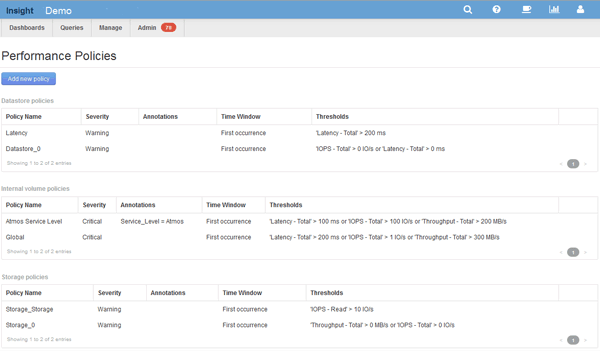

= 建立效能原則
:allow-uri-read: 
:icons: font
:imagesdir: ../media/

[role="lead"]
您可以建立效能原則來設定觸發警示的臨界值、以通知您有關網路資源的問題。例如、您可以建立效能原則、在儲存資源池的總使用率超過60%時發出警示。

== 步驟

. 在OnCommand Insight 瀏覽器中開啟
. 選擇*管理*>*效能原則*。
+
隨即顯示「效能原則」頁面。

+
原則會依物件組織、並依照原則在清單中出現的順序進行評估。

. 按一下「*新增原則*」。
+
此時會顯示「新增原則」對話方塊。

. 在*原則名稱*欄位中、輸入原則的名稱。
+
您必須使用不同於物件所有其他原則名稱的名稱。例如、內部磁碟區不能有兩個名為「延遲」的原則、不過內部磁碟區可以有「延遲」原則、而另一個磁碟區則有「延遲」原則。最佳實務做法是永遠為任何原則使用唯一名稱、無論物件類型為何。

. 從「*套用至類型*的物件」清單中、選取套用原則的物件類型。
. 從「*含註釋*」清單中、選取註釋類型（若適用）、然後在「*值*」方塊中輸入註釋的值、以僅將原則套用至已設定此特定註釋的物件。
. 如果您選取*連接埠*做為物件類型、請從*連接至*清單中、選取連接埠的連接目標。
. 從「*套用後的時間*」清單中、選取警示提出以指出違反臨界值的時間。
+
第一次發生選項會在第一次資料樣本超過臨界值時觸發警示。當臨界值超過一次且持續超過指定時間、所有其他選項都會觸發警示。

. 從「*含嚴重性*」清單中、選取違規的嚴重性。
. 根據預設、系統會將違反原則的電子郵件警示傳送給全域電子郵件清單中的收件者。您可以覆寫這些設定、以便將特定原則的警示傳送給特定的收件者。
+
** 按一下連結以開啟收件者清單、然後按一下「*+*」按鈕以新增收件者。該原則的違規警示將傳送給清單中的所有收件者。

. 按一下「*建立警示（如果下列任一項為真）」區段中的*任一*連結、以控制警示的觸發方式：
+
** *任何*
+
這是預設設定、會在超過任何與原則相關的臨界值時建立警示。

** *全部*
+
此設定會在超過原則的所有臨界值時建立警示。當您選取*全部*時、您為效能原則建立的第一個臨界值即稱為主要規則。您必須確保主要規則臨界值是您最關心效能原則的違規行為。

. 在「*建立警示條件*」區段中、選取效能計數器和運算子、然後輸入值以建立臨界值。
. 按一下*新增臨界值*以新增更多臨界值。
. 若要移除臨界值、請按一下垃圾桶圖示。
. 如果您希望原則在發生警示時停止處理、請選取「如果產生警示、則停止處理其他原則*」核取方塊。
+
例如、如果您有四個資料存放區原則、而第二個原則設定為在發生警示時停止處理、則第三個和第四個原則不會在發生違反第二個原則的情況下處理。

. 按一下「 * 儲存 * 」。
+
隨即顯示「效能原則」頁面、且效能原則會出現在物件類型的原則清單中。

