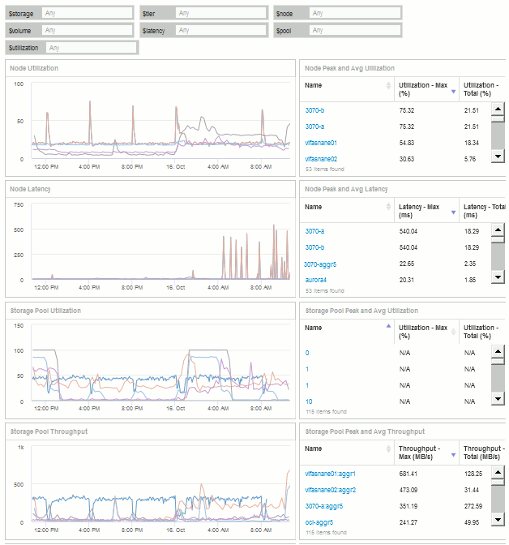
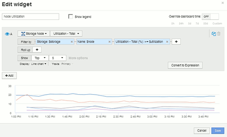
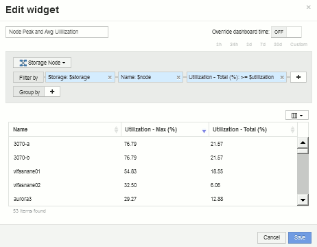
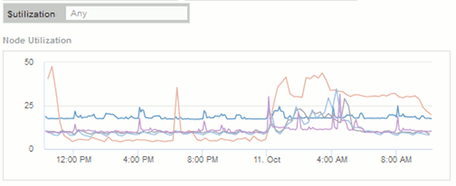
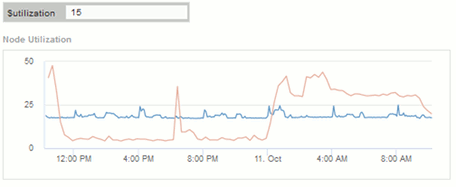

= 儲存節點使用率儀表板範例、其中含有變數
:allow-uri-read: 
:icons: font
:imagesdir: ../media/

[role="lead"]
建立儲存分析的自訂儀表板、其中包含儲存設備、儲存資源池、節點、層級、使用率和延遲等變數。

== 開始之前

建議您熟悉Insight中的儀表板、但不需要。

== 關於這項工作

下列程序將建立自訂的儲存分析總覽儀表板、使用儲存設備、儲存資源池、節點、層級、使用率和延遲等變數。以下範例中的變數將用於篩選儀表板上一或多個可用小工具的顯示資產或度量。使用這些變數做為篩選條件的小工具、將會根據儀表板變數欄位中輸入的值、隨需更新篩選內容、讓您快速篩選多個圖表、以便向下切入特定的興趣領域。

依照本範例中的步驟、您將建立如下的儀表板。您可以變更這些小工具、或新增任何數量的額外小工具、以反白顯示您選擇的任何資料。

== 步驟

. 建立新的儀表板、並將其命名為「Analysis：Storage Overview」（分析：儲存總覽）、或是具有相同說明性的儀表板。
. 按一下「*變數*」下拉式清單、然後選取「*文字*變數類型」。根據預設、變數名稱為_$var1_。按一下_$var1_以編輯名稱、並將其變更為$storage、然後按一下核取標記以儲存變數。重複此步驟、為_$nod__、_$Pool_和_$volume建立文字變數。
. 重複上述程序、建立名為「$utilization」和「$imepart__」的*數字*類型變數。
. 按一下「*變數*」下拉式清單、然後搜尋_層級_註釋。選取此選項以建立名為_$Tier的變數。
+
您可以隨時新增變數、不過您可以更輕鬆地在前端建立變數、以便在建立時提供給所有小工具。

. 按一下「*小工具*」下拉式清單、然後選取「*折線圖*」或「*區域圖*」小工具、即可新增小工具。將小工具命名為「節點使用率」。按一下「*儲存設備*」資產類型、將其變更為「*儲存節點*」。選取*使用率-總計*作為圖表資料。
. 按一下*篩選條件+*按鈕以新增篩選條件。搜尋並選取* Storage *、然後按一下* any *、然後選取_$Storage_變數。
. 按一下「**+**」按鈕以新增「*名稱*」的另一個篩選器。將變數設為_$nod__。
+
註釋名稱篩選器可指派不同的變數。視Widget中的物件而定、在最低層級使用名稱/變數配對。例如：

+
** 您可以將_$nod__變數指派給「節點導向」小工具的*名稱*篩選器。
** 您可以將$Pool_變數指派給以資源池為焦點的Widget的*名稱*篩選器。

. 按一下「**+**」按鈕以新增「*使用率-總計（%）*」篩選器。將變數設為_>=$utilation_。
. 按一下「*上移*」欄位後的*「*上移*」、即可收合欄位。
. 選取*顯示前5名*、然後按一下*儲存*以儲存小工具並返回您的儀表板。
+
您的小工具應如下所示：

+

. 將另一個折線圖或區域圖小工具新增至儀表板。選擇*儲存節點*作為資產類型、*延遲-總計*作為製表的度量。
. 按一下「*篩選條件+*」按鈕、即可新增*儲存設備：$Storage*和*名稱：$node*的篩選條件。
. 新增*延遲-總計*的篩選器、然後選取*$延遲*變數。
. 將小工具命名為「Node Latency（節點延遲）」並加以儲存。
. 您可以新增支援表格、以顯示所建立圖表的更多詳細資料、例如「最大節點使用率」或「平均節點使用率」。將*表格小工具*新增至儀表板、並選取*儲存節點*作為資產類型、然後建立*儲存設備：$Storage*、*名稱：$node*和*使用率-總計：$utility*的篩選條件。
. 在表中新增*使用率-最大*、*使用率-總計*或任何其他所需欄位的欄。
. 將小工具命名為「節點尖峰和平均使用率」並加以儲存。
+

. 重複這些步驟以建立節點延遲表格、並視需要顯示*延遲-最大*、*延遲-總計*或其他欄。
. 若要全面展示儀表板、您可以針對下列部分或全部項目新增其他圖表和表格小工具：

|===

| 圖表 | 表 

 a| 
儲存資源池使用率
 a| 
儲存資源池尖峰和平均使用率

 a| 
儲存資源池處理量
 a| 
儲存資源池尖峰和平均處理量

 a| 
Volume延遲
 a| 
Volume尖峰和平均延遲

 a| 
Volume IOPS
 a| 
Volume尖峰和平均IOPS

|===
. 您可以在儀表板上移動及調整小工具的大小、無論您想要放置在何處。完成後、請務必*儲存*儀表板。
+
您的最終儀表板外觀如下：

+

. 您可以使用這些變數來專注於儀表板中的特定資產。當您在變數欄位中輸入值時、小工具會自動更新以反映這些變數。例如、在$utilization變數欄位中輸入「'15'」、使用該變數更新的小工具只會顯示總使用率>= 15%的資產。
+
節點使用率Widget顯示所有節點前5名：

+

+
節點使用率Widget顯示使用率達15%或更高的節點：

+

. 建立小工具時請謹記下列事項：
+
** $Tiier變數只會影響以* Ti分級*註釋註釋的資源。
** 並非所有篩選器都會影響所有小工具、視小工具是否設計為接受指定的變數而定。
** 數字變數會套用為「大於或等於」指定的值。請注意、只要變數對執行小工具的資產有效、任何變數都可以在儲存階層的任何層級上做為任何小工具的篩選器。當您從節點層級向下移至儲存資源池、然後移至Volume Widget時、會有更多變數可供指派為篩選器。例如、在儲存節點層級小工具中、可以將_Storage_和_Name_變數指派為篩選器。在儲存資源池層級、_Storage_、_節點_、_Storage Pools_和_Name_均可使用。視需要指派變數、並在堆疊的最低層級使用$name變數。如此一來、您的$name變數就能根據執行Widget的資產實際名稱進行篩選。

