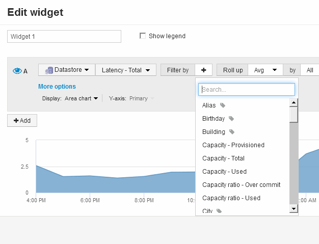

= 儀表板Widget查詢與篩選器
:allow-uri-read: 
:icons: font
:imagesdir: ../media/

[role="lead"]
儀表板中的查詢小工具是管理資料顯示的強大工具。以下是小工具查詢的一些注意事項。

部分小工具最多可有五個查詢。每個查詢都會在Widget中繪製自己的一組行或圖表。在一個查詢上設定彙總、群組、上/下結果等、不會影響該Widget的任何其他查詢。

您可以按一下眼圖示、暫時隱藏查詢。當您隱藏或顯示查詢時、Widget會自動顯示更新。這可讓您在建立小工具時、檢查所顯示的個別查詢資料。

下列Widget類型可以有多個查詢：

* 區域圖
* 堆疊區域圖
* 折線圖
* 不規則曲線圖
* 單一值小工具

其餘的Widget類型只能有一個查詢：

* 表
* 長條圖
* 方塊繪圖
* 散佈繪圖

== 在儀表板查詢中篩選

您可以使用下列任一項進行篩選、以精簡查詢中任何*文字欄位*的搜尋：

* 星號可讓您搜尋所有內容。例如、 `vol*rhel` 顯示以「'vol'」開頭並以「'RHEL」結尾的所有資源。
* 問號可讓您搜尋特定的字元數。例如、 `BOS-PRD??-S12` 顯示BOS-PRD12-S12、BOS-PRD13-S12等。
* 或運算子可讓您指定多個實體。例如、 `FAS2240 OR CX600 OR FAS3270` 尋找多種儲存模式。
* Not運算子可讓您從搜尋結果中排除文字。例如、 `NOT EMC*` 找到開頭不是「'eme'」的所有項目。您可以使用 `NOT *` 顯示包含null值的欄位。

如果您以雙引號括住篩選字串、Insight會將第一個和最後一個報價之間的所有內容視為完全相符。報價內的任何特殊字元或運算子都將視為文字。例如、篩選「*」會傳回文字星號的結果；在此情況下、星號不會視為萬用字元。在雙引號中加上運算子AND、OR和Not時、也會被視為字串。

== 識別查詢和篩選器傳回的物件

查詢和篩選所傳回的物件看起來類似下圖所示。指派「標記」的物件為附註、而不含標籤的物件則為效能計數器或物件屬性。

