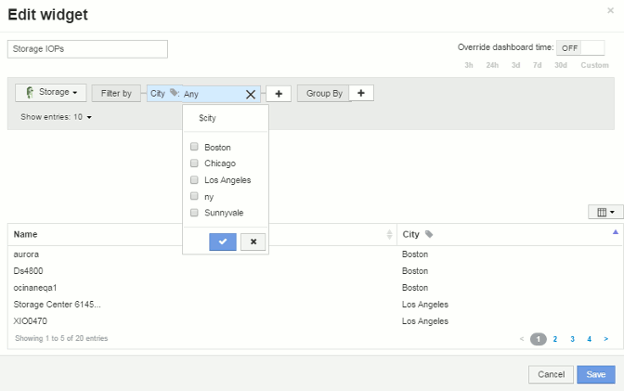

= 儀表板變數
:allow-uri-read: 
:icons: font
:imagesdir: ../media/

[role="lead"]
儀表板變數可讓您快速輕鬆地篩選儀表板上多個小工具的資料。

== 開始之前

此範例需要在多個儲存資產上設定*城市*註釋（也稱為城市屬性）。

若要獲得最佳結果、請在不同的儲存區設定不同的城市。

== 關於這項工作

變數提供一種快速簡單的方法、可篩選自訂儀表板上部分或全部小工具中顯示的資料。下列步驟將引導您建立使用變數的小工具、並示範如何在儀表板上使用這些小工具。

== 步驟

. 以具有管理權限的使用者身分登入Insight
. 按一下*儀表板*>*+新儀表板*。
. 在新增小工具之前、我們要定義用來篩選儀表板資料的變數。按一下*變數*按鈕。
+
隨即顯示屬性清單。

. 假設我們想要設定儀表板以根據城市進行篩選。從清單中選取*城市*屬性。
+
$城市 變數欄位隨即建立並新增至儀表板。

. 接下來、我們必須告訴小工具使用此變數。最簡單的方法是新增顯示「城市」欄的表格小工具。按一下「*小工具*」按鈕、然後選取「*表格*」小工具。
. 首先、從欄選取器選取「城市」欄位、將其新增至表格 image:../media/column-picker-button.gif[""] 按鈕。
+
城市是清單類型屬性、因此包含先前定義的選項清單。您也可以選擇文字、布林或日期類型屬性。

. 接著、按一下*篩選條件+*按鈕、然後選擇*城市*。
. 按一下*任一*以檢視「城市」的可能篩選選項。請注意、除了先前提供的選項之外、清單上的「$city」也會顯示在頂端。選取「'$城市」以使用此儀表板變數。
+
「$city」選項只有在先前已在主儀表板頁面上定義時才會出現在此處。如果先前未定義變數、則只會顯示篩選器的現有選項。只有適用於所選屬性類型的變數會顯示在該篩選器的下拉式清單中。

+

. *儲存*小工具。
. 在儀表板頁面上、按一下$城市 變數旁的*任一*、然後選取您要查看的城市或城市。
+
您的表格小工具會更新、僅顯示您選取的城市。您可以隨意變更$城市 變數中的值、儀表板上設定為使用$城市 變數的所有小工具都會自動重新整理、僅顯示所選值的資料。

. 請務必*儲存*您的儀表板、以符合您的需求。

