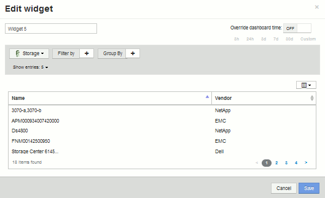
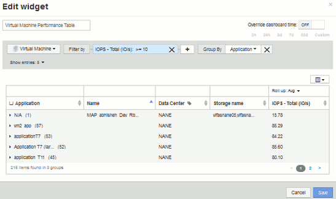
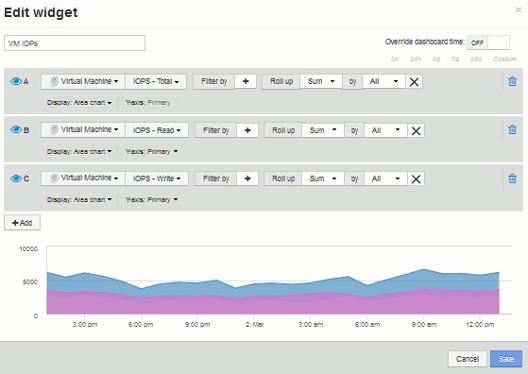
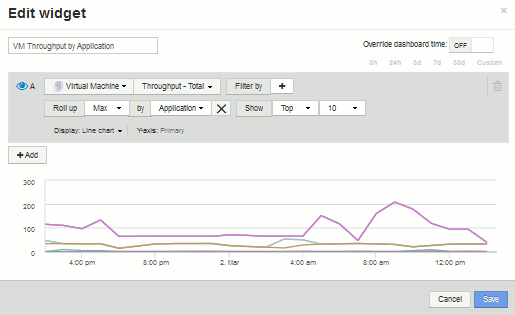
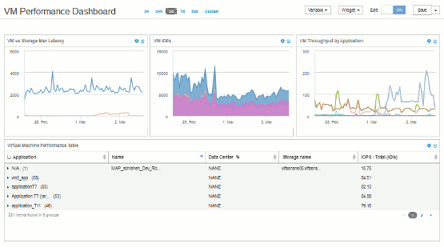

= 自訂儀表板：虛擬機器效能
:allow-uri-read: 
:icons: font
:imagesdir: ../media/

[role="lead"]
《Insight》的自訂儀表板和小工具可協助提供庫存與效能趨勢的營運檢視OnCommand 。

== 關於這項工作

現今IT營運面臨許多挑戰。系統管理員必須以更少的資源完成更多工作、而且必須完全掌握動態資料中心。在此範例中、我們將示範如何使用小工具建立自訂儀表板、讓您深入瞭解環境中的虛擬機器效能。依照此範例建立小工具以滿足您自己的特定需求、相較於前端虛擬機器（VM）效能、您將能視覺化後端儲存效能、或檢視VM延遲與I/O需求。

自訂儀表板可讓您排定工作優先順序、並識別資源可用度。您可以回應工作負載的退潮和流程、並將偵測和修正新興問題的時間降至最低。自訂儀表板可讓您靈活地建立業務關鍵基礎架構的優先檢視、並有助於識別多家廠商技術的效能可用度。

我們將在此建立一個虛擬機器效能儀表板、其中包含下列項目：

* 列出VM名稱與效能資料的表格
* 比較VM延遲與儲存延遲的圖表
* 顯示VM讀取、寫入和IOPS總計的圖表
* 顯示VM處理量上限的圖表

這只是一個基本範例。您可以自訂儀表板、針對自己的營運最佳實務做法、強調及比較您選擇的任何效能資料。

== 步驟

. 以具有管理權限的使用者身分登入Insight。
. 從*儀表板*功能表中、選取*+新儀表板*。
+
隨即開啟「新增儀表板」頁面。

. 讓我們為儀表板命名一個有意義的名稱。按一下「 * 儲存 * 」。在*名稱*欄位中、輸入儀表板的唯一名稱、例如「VM Performance by Application」。
. 按一下「*儲存*」以新名稱儲存儀表板。
. 讓我們開始新增小工具。如有必要、請將*編輯*切換至「On」（開啟）以啟用「Edit」（編輯）模式。
. 按一下「*小工具*」按鈕、然後選取「*表格小工具*」、將新的表格小工具新增至儀表板。
+
「編輯小工具」對話方塊隨即開啟。預設名稱為「Widget 1」、顯示的預設資料適用於您環境中的所有儲存設備。

+

. 我們可以自訂此小工具。在Name（名稱）欄位中、刪除「Widget 1」、然後輸入「Virtual Machine Performance table」。
. 按一下資產類型下拉式清單、並將* Storage *變更為* Virtual Machine *。
+
表格資料會變更、以顯示您環境中的所有虛擬機器。目前、表格只會顯示VM名稱。現在就讓我們在表格中新增幾欄。

. 按一下*欄*image:../media/column-picker-button.gif[""] 按鈕、然後選取「_Data Center"、「_Storage name_」和「_IOPS -總計_」。您也可以嘗試在搜尋中輸入名稱、以快速顯示所需的欄位。
+
這些欄現在會顯示在表格中。您可以根據這些欄位中的任何欄位來排序表格。請注意、這些欄會依照新增至小工具的順序顯示。

. 在本練習中、我們會排除未使用中的VM、因此我們來篩選出總IOPS低於10的任何項目。按一下「*篩選條件*」旁邊的「+」按鈕、然後選取「_IOPS -總計（IO/s）_」。按一下「* any *」、然後在「* from *」欄位中輸入「'10'」。將*收件人*欄位保留空白。按一下 image:../media/check-box-ok.gif[""] 按鈕以儲存篩選條件。
+
此表現在僅顯示總IOPS為10或以上的VM。

. 我們可以將結果分組、進一步摺疊表格。按一下*群組依據*旁的「+」按鈕、然後選取要分組的欄位、例如應用程式或叢集。系統會自動套用群組。
+
表格列現在會根據您的設定進行分組。您可以視需要展開及收合群組。群組列會顯示每個欄的彙總資料。有些欄可讓您選擇該欄的彙總方法。

+

. 當您已自訂表格小工具以達到滿意度時、請按一下*儲存*按鈕。
+
表格小工具會儲存至儀表板。

. 您可以拖曳右下角、在儀表板上調整Widget的大小。讓小工具變寬、以便清楚顯示所有欄。按一下「*儲存*」以儲存目前的儀表板。
. 接下來、我們會新增一些圖表來顯示我們的VM效能。我們來建立比較VM延遲與儲存延遲的折線圖。
. 如有必要、請將*編輯*切換至「On」（開啟）以啟用「Edit」（編輯）模式。
. 按一下「*小工具*」按鈕、然後選取「*折線圖*」、將新的折線圖小工具新增至儀表板。
+
「編輯小工具」對話方塊隨即開啟。按一下*名稱*欄位、並將此小工具命名為「VM vs Storage Max Latency」（VM vs儲存設備最大延遲）

. 選擇*虛擬機器*、然後選擇*延遲-最大*。設定您想要的任何篩選條件、或將*篩選條件*保留為空白。對於* Roll up*、請選擇「'um'」by「'All'」。將此資料顯示為「**折線圖」、並將「Y軸」保留為「*主*」。
. 按一下「*+附加*」按鈕以新增第二個資料行。在此行中、選取* Storage *和* Latency - Max*。設定您想要的任何篩選條件、或將*篩選條件*保留為空白。對於* Roll up*、請選擇「'um'」by「'All'」。將此資料顯示為「**折線圖」、並將「Y軸」保留為「*主*」。
+
image::../media/customdash-latencywidgetsettings.gif[自訂網址設定]

. 按一下「*儲存*」、將此小工具新增至儀表板。
. 接下來、我們將在單一圖表中新增顯示VM讀取、寫入和IOPS總計的圖表。
. 按一下「*小工具*」按鈕、然後選取「*區域圖*」、將新的區域圖小工具新增至儀表板。
+
「編輯小工具」對話方塊隨即開啟。按一下*名稱*欄位、並將此小工具命名為「VM IOPS」

. 選擇*虛擬機器*、然後選擇* IOPS -總計*。設定您想要的任何篩選條件、或將*篩選條件*保留為空白。對於* Roll up*、請選擇「'um'」by「'All'」。將此資料顯示為「區域圖」、並將「Y軸」保留為*「主要」*。
. 按一下「+新增」按鈕以新增第二個資料行。在此行中、選取*虛擬機器*、然後選擇* IOPS - read*。將Y軸保留為*主要*。
. 按一下「+新增」按鈕以新增第三個資料行。在此行中、選取*虛擬機器*、然後選擇* IOPS - Write *（寫入*）。將Y軸保留為*主要*。
+

. 按一下「*儲存*」、將此小工具新增至儀表板。
. 接下來、我們將新增圖表、顯示與VM相關之每個應用程式的VM處理量。我們將針對此使用「彙總」功能。
. 按一下「*小工具*」按鈕、然後選取「*折線圖*」、將新的折線圖小工具新增至儀表板。
+
「編輯小工具」對話方塊隨即開啟。按一下*名稱*欄位、並將此小工具命名為「VM ThroU提交 量（依應用程式）」

. 選擇*虛擬機器*、然後選擇*處理量-總計*。設定您想要的任何篩選條件、或將*篩選條件*保留為空白。對於* Roll up*、請選擇「Max」、然後選擇「Application」或「Name」。顯示*前十名*應用程式。將此資料顯示為「**折線圖」、並將「Y軸」保留為「*主*」。
+

. 按一下「*儲存*」、將此小工具新增至儀表板。
. 您可以在小工具頂端的任何位置按住滑鼠按鈕、然後拖曳至新位置、以移動小工具。您可以拖曳右下角來調整小工具的大小。進行變更後、請務必*儲存*儀表板。
+
您的最終VM效能儀表板如下所示：

+

