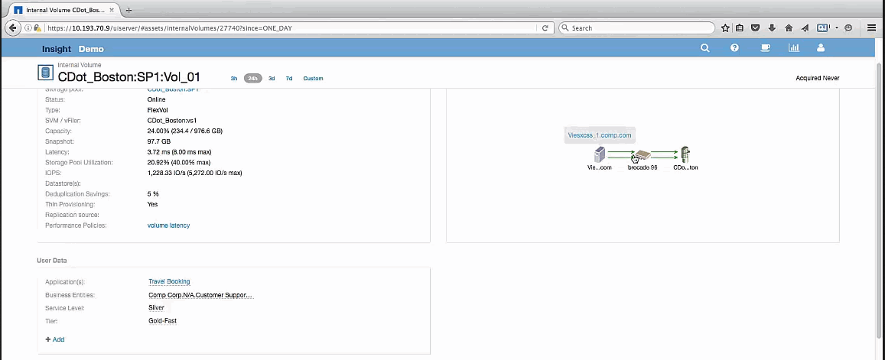
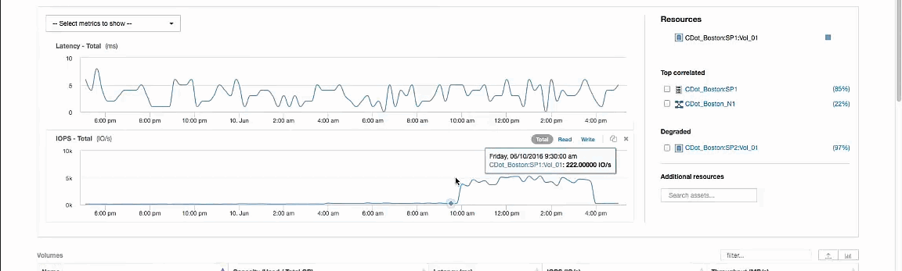

= 檢查資源的貪度
:allow-uri-read: 
:icons: font
:imagesdir: ../media/

[role="lead"]
按一下識別為「貪資源」的內部磁碟區、即可開啟Volume CDot_波士頓：SP1：Vol _01的登陸頁面。

附註在摘要詳細資料中、此內部磁碟區是不同應用程式（差旅訂票）的資源、雖然包含在不同的儲存資源池中、但與Exchange 2016的內部磁碟區（CDot_波士頓_N1）位於同一個節點上

登陸頁面顯示：

* 與差旅訂位應用程式相關的內部Volume。
* 關聯資源中會識別出新的儲存資源池。
* 您正在檢查的原始內部磁碟區（CDot_波士頓：SP2：Vol_01）會識別為「降級」。
* 在效能圖表中、應用程式具有穩定的延遲設定檔、而且在Exchange應用程式上、IOPS尖峰大致會同時出現延遲高峰。
+
這可能表示Exchange應用程式的延遲尖峰可能是因為此磁碟區的IOPS尖峰所造成。

在「資源」區段的圖表右側、您會注意到Exchange 2016內部磁碟區（CDot_波士頓：SP2：Vol（Vol）01）的「相關降級」資源。按一下核取方塊、將降級的內部磁碟區納入效能圖表中。對齊這兩個效能圖表可顯示延遲和IOPS尖峰幾乎完全相同。這表示我們想要更深入瞭解差旅訂位申請。我們必須瞭解應用程式為何面臨如此長時間的IOPS尖峰。

檢查與Travel Booking應用程式相關聯的儲存資源池、可能會找出應用程式遇到IOPS尖峰的原因。按一下CDot_波士頓：SP1以檢視儲存資源池登陸頁面。
